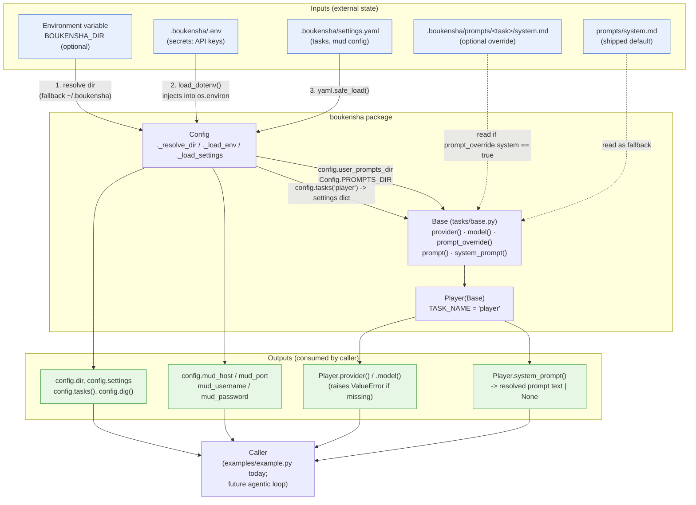
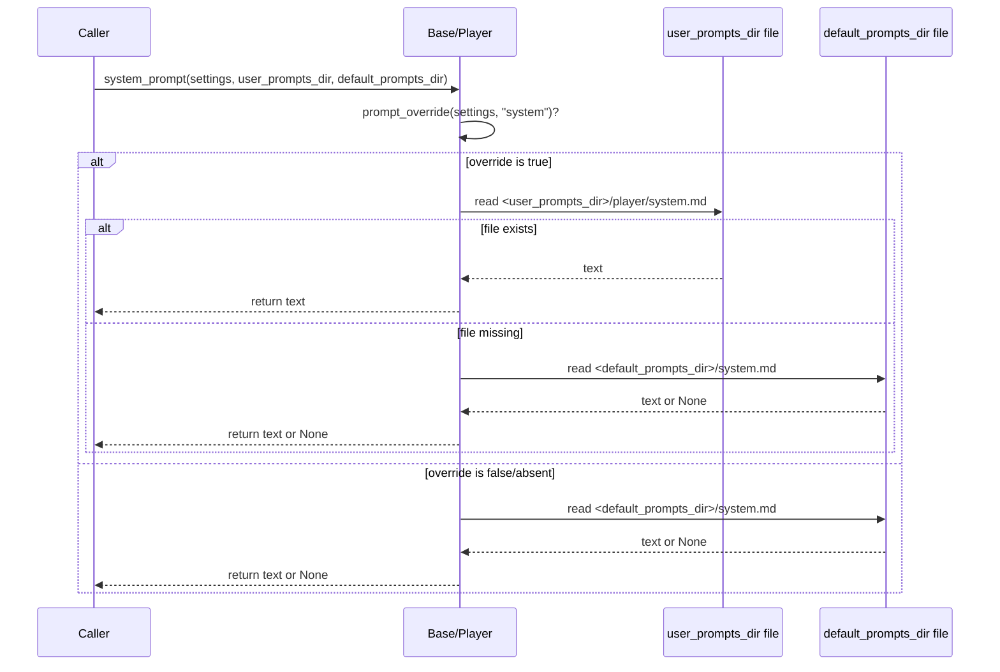

# Architecture — `boukensha` Config (Python)

Code review summary and architecture diagram for `src/boukensha/`.

## Component overview

| Component | Responsibility |
|---|---|
| **`Config`** (`config.py`) | Resolves the `.boukensha` directory, loads `.env` into the process environment, parses `settings.yaml`, and exposes typed accessors (`tasks()`, `dig()`, `mud_*`). It is the single entry point consumers construct. |
| **`Base`** (`tasks/base.py`) | Stateless task contract. Every method is a `classmethod`/`staticmethod` operating on an explicit `settings` dict — no task instances are created. Resolves `provider`, `model`, and system-prompt overrides (user file vs. shipped default). |
| **`Player`** (`tasks/player.py`) | Concrete task (`TASK_NAME = "player"`); currently adds nothing beyond `Base`. |
| **`examples/example.py`** | Smoke-test / reference consumer: builds a `Config`, pulls the `player` task settings, and prints resolved values. |

Design note: `Config` owns *where things live and what's configured*; `Base`/`Player` own *how a task interprets its own settings slice* — the two never reach into each other's internals, they only pass a `settings: dict` and directory strings across the boundary.

## Data flow diagram

## Prompt resolution sequence

Zooms in on `Base.prompt()`, the one non-trivial control-flow path in the module.

## Notes from review

- **Fail-fast on required config**: `Base.provider()` / `Base.model()` raise `ValueError` immediately when missing from `settings.yaml`, rather than silently defaulting — appropriate since a task can't run without them.
- **Graceful fallback elsewhere**: `.env` and `settings.yaml` are optional (missing files just yield `{}` / no-op), and MUD host/port fall back to `localhost:4000` — sensible defaults for local development.
- **Stateless task classes**: `Base`/`Player` never instantiate; every call takes `settings` explicitly, which keeps task logic pure and easy to unit test without constructing a `Config`.
- **Directory resolution is env-var-first**: `BOUKENSHA_DIR` must be set *before* `Config()` loads `.env`, since `.env` lives inside the directory being resolved — a deliberate ordering constraint worth keeping in mind if it's ever refactored.
