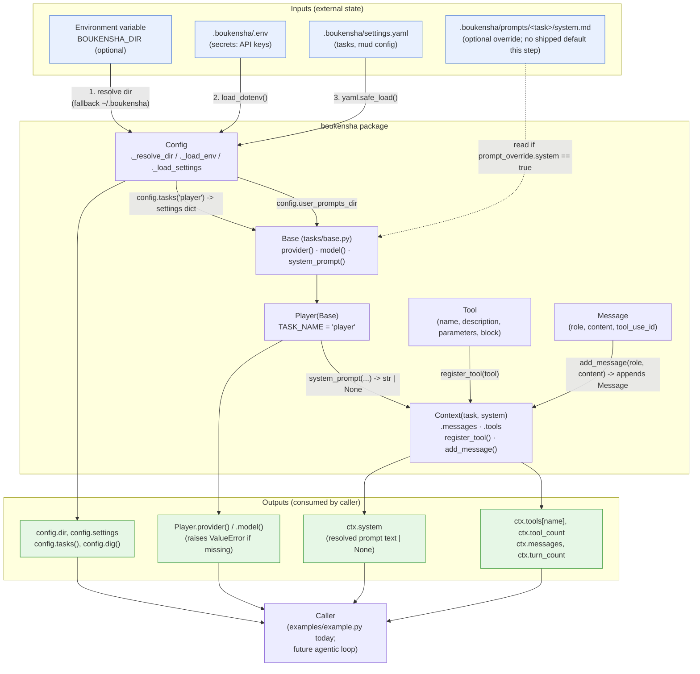

# Architecture — `boukensha` Struct Skeleton (Python)

Code review summary and architecture diagram for `src/boukensha/`.

## Component overview

| Component | Responsibility |
|---|---|
| **`Config`** (`config.py`) | Carried forward from `00_config` unchanged except one dropped constant (`PROMPTS_DIR`). Resolves the `.boukensha` directory, loads `.env`, parses `settings.yaml`, and exposes typed accessors (`tasks()`, `dig()`, `mud_*`, `user_prompts_dir`). |
| **`Base`** (`tasks/base.py`) | Carried forward unchanged. Stateless task contract — every method is a `classmethod`/`staticmethod` operating on an explicit `settings` dict. Resolves `provider`, `model`, and system-prompt overrides. |
| **`Player`** (`tasks/player.py`) | Carried forward unchanged. Concrete task (`TASK_NAME = "player"`); adds nothing beyond `Base`. |
| **`Tool`** (`tool.py`) | New. `@dataclass` — `name`, `description`, `parameters: dict`, `block: Callable`. The direct Python equivalent of Ruby's `Struct.new(:name, :description, :parameters, :block)`. Pure data holder, no behavior beyond `__str__`. |
| **`Message`** (`message.py`) | New. `@dataclass` — `role`, `content`, `tool_use_id: str \| None = None`. One unit of conversation; `tool_use_id` links a tool result back to the call that requested it. |
| **`Context`** (`context.py`) | New. Hand-written class (not a dataclass, matching the `Config` precedent) — holds everything needed to make one API call: a `task` class reference, an optional `system` prompt string, a `messages: list[Message]`, and a `tools: dict[str, Tool]`. Provides `register_tool()`, `add_message()`, and derived `tool_count`/`turn_count` properties. |
| **`examples/example.py`** | Smoke-test / reference consumer: builds a `Config`, resolves the `player` task's system prompt, constructs a `Context`, registers a `move` tool, appends two messages, and prints everything. |

Design note: this step adds no new *behavior* to the config/task layer — `Config`/`Base`/`Player` are byte-for-byte carries forward from `00_config` (minus `PROMPTS_DIR`, since this step ships no `prompts/` directory of its own). The new work is entirely the struct layer (`Tool`, `Message`, `Context`) that a future agentic loop will thread through repeatedly. `Tool` and `Message` are pure data (`@dataclass`); `Context` is the one new type with behavior, and it only reaches into `Tool`/`Message` by storing/returning them — it never inspects `Config` or `Base` internals, just holds a reference to the `task` class and an already-resolved `system` string.

## Data flow diagram

## Notes from review

- **No new behavior, only new data shapes**: `Config`/`Base`/`Player` are carried forward unchanged from `00_config`; this step's actual diff is `Tool`, `Message`, `Context`. Reviewing this folder in isolation means most of the "interesting" control flow (system-prompt resolution) already lives in `00_config`'s docs — see that folder's architecture doc for the `Base.prompt()` fallback sequence, which is identical here.
- **A dropped constant changes real behavior, not just cosmetics**: `Config.PROMPTS_DIR` (the shipped default-prompt directory) is absent in this step. `examples/example.py` therefore calls `Player.system_prompt(...)` without a `default_prompts_dir` argument at all, so unless a user has placed `.boukensha/prompts/player/system.md` *and* set `prompt_override.system: true` in `settings.yaml`, `system_prompt` silently returns `None` — no shipped fallback text exists yet. This is a deliberate scope decision (matches the Ruby original for this step), not a bug, but it's easy to mistake for a missing feature when reading this folder alone.
- **Struct vs. class split follows a consistent rule**: pure field containers with no behavior (`Tool`, `Message`) become `@dataclass`; anything with behavior or derived state (`Context`, like `Config` before it) stays a hand-written class. `Tool`/`Message` are mutable (non-frozen) dataclasses, mirroring Ruby `Struct`'s mutability rather than defaulting to Python's more defensive `frozen=True`.
- **`Context` is a thin, ordering-free container**: `register_tool` keys tools by `tool.name`, so registering two tools with the same name silently overwrites the first (no fail-fast check) — acceptable for a smoke-test step but worth flagging if `Context` ever needs to detect duplicate tool registration. `add_message` has no validation on `role` (any string is accepted), consistent with this step's "just a data holder" scope.
- **`Context.__str__` has one asymmetric special case**: `self.task` is typed `type[Base]` (a class, not an instance) and `__str__` explicitly guards `if self.task is not None else None` before calling `.task_name()` — the only defensive branch in an otherwise assumption-light constructor, since `Context(task=None)` is technically permitted by the type hint (`task: type[Base]` isn't `Optional`, but nothing enforces it at runtime).
- **Truncation lengths are copied faithfully, not "cleaned up"**: `Tool.__str__` truncates `description` to 41 chars (`[:41]`) with no `...` suffix, while `Message.__str__` truncates `content` to 61 chars (`[:61]`) and always appends `...` even when the content is shorter than the limit — both quirks are intentional parity with the Ruby original's inclusive-range slicing (`[0..40]`, `[0..60]`), not independently-designed Python formatting choices.
- **Still stateless at the task layer, still no test suite**: `Base`/`Player` remain instance-free (all classmethods over an explicit `settings` dict), and this step adds no `pytest` dependency — matching the Ruby original's scope and `00_config`'s established precedent of deferring tests to a later step.
