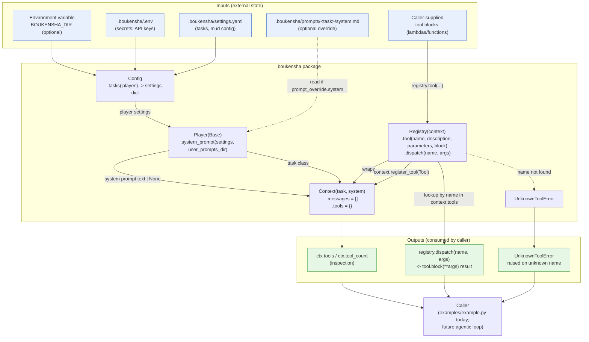
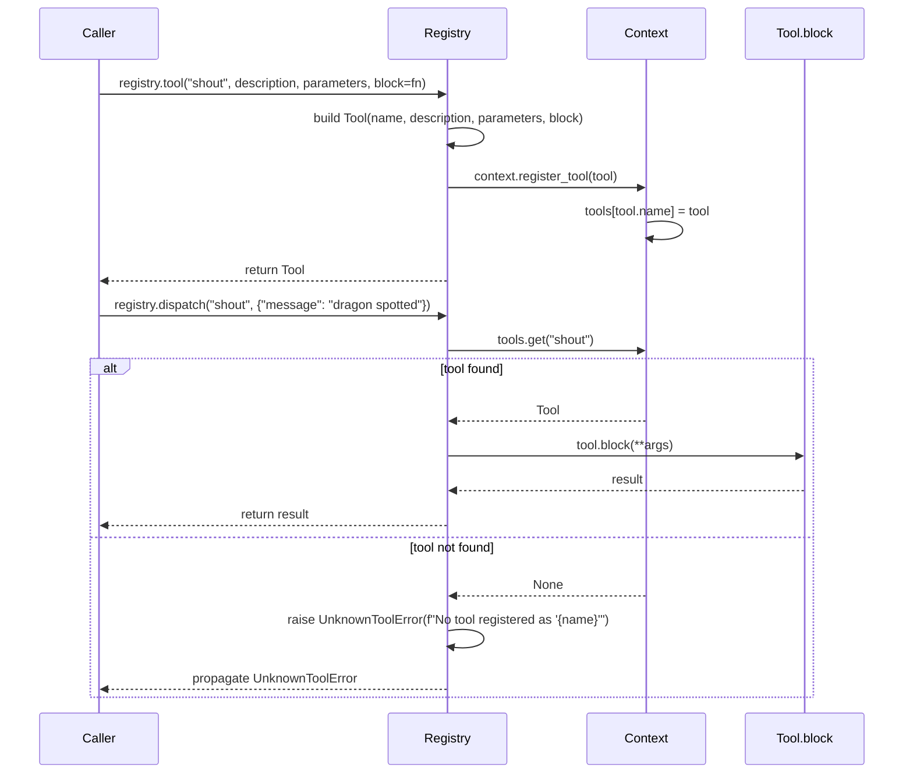

# Architecture — `boukensha` The Registry (Python)

Code review summary and architecture diagram for `src/boukensha/`.

## Component overview

| Component | Responsibility |
|---|---|
| **`Config`** (`config.py`) | Resolves the `.boukensha` directory, loads `.env` into the process environment, parses `settings.yaml`, and exposes typed accessors (`tasks()`, `dig()`, `mud_*`). Carried forward unchanged from `01_struct_skeleton`. |
| **`Base`** (`tasks/base.py`) | Stateless task contract. Every method is a `classmethod`/`staticmethod` operating on an explicit `settings` dict — no task instances are created. Resolves `provider`, `model`, and system-prompt overrides. Unchanged from `01_struct_skeleton`. |
| **`Player`** (`tasks/player.py`) | Concrete task (`TASK_NAME = "player"`); adds nothing beyond `Base`. Unchanged. |
| **`Tool`** (`tool.py`) | Plain `@dataclass` describing one agent-invocable action: `name`, `description`, `parameters`, and `block` (the callable that performs it). Unchanged. |
| **`Message`** (`message.py`) | Plain `@dataclass` for one turn of conversation: `role`, `content`, optional `tool_use_id`. Unchanged. |
| **`Context`** (`context.py`) | Holds everything needed to make an API call: the task class, the system prompt, the accumulated `messages` list, and the `tools` dict (name → `Tool`). Exposes `register_tool()`, `add_message()`, and derived `tool_count`/`turn_count`. Unchanged. |
| **`UnknownToolError`** (`errors.py`) — **new this step** | `Exception` subclass raised when `Registry.dispatch()` is called with a name that has no registered tool — an explicit error boundary rather than a silent no-op. |
| **`Registry`** (`registry.py`) — **new this step** | Wraps a `Context`. `.tool(...)` builds a `Tool` and registers it onto the wrapped context (`context.register_tool`); tools still live on the `Context`, not on the `Registry` itself. `.dispatch(name, args)` looks up the tool by name on `context.tools` and calls `tool.block(**args)`, raising `UnknownToolError` if the name is unrecognized. |
| **`examples/example.py`** | Smoke-test / reference consumer: builds `Config` → `Player.system_prompt()` → `Context` → `Registry`, registers two tools (`move`, `shout`) through the registry, dispatches both successfully, then dispatches an unregistered tool to demonstrate the `UnknownToolError` boundary. |

Design note: this step is purely additive on top of `01_struct_skeleton` — `Config`, `Base`/`Player`, `Tool`, `Message`, and `Context` are byte-identical to the prior snapshot. `Registry` is a thin indirection layer sitting *in front of* `Context`: it never stores tools itself, it only mutates and reads the `Context` it was constructed with. This keeps `Context` the single source of truth for "what tools exist" while giving callers (and, later, an agent loop) one place to register and invoke tools by name instead of poking `context.tools` directly.

## Data flow diagram

## Tool registration and dispatch sequence

Zooms in on `Registry.tool()` / `Registry.dispatch()`, the one non-trivial control-flow path this step adds.

## Notes from review

- **Registry never owns tool state**: `Registry` holds only a reference to the `Context` it wraps (`self._context`); tools are stored on `context.tools`, not on the registry itself. This means multiple registries could in principle share/observe the same context, and inspecting `ctx.tools` after registration works identically whether tools were added via `Registry.tool()` or directly via `context.register_tool()`.
- **Fail-fast on unknown dispatch**: `Registry.dispatch()` raises `UnknownToolError` immediately rather than returning `None` or swallowing the miss — an unrecognized tool name is treated as a caller/agent bug that should surface, not a soft failure to route around silently.
- **`errors.py` deliberately subclasses `Exception`, not `BaseException`**: matches Ruby's `UnknownToolError < StandardError` — reserved for ordinary application errors, leaving `SystemExit`/`KeyboardInterrupt`-style conditions alone.
- **No key-transformation step in `dispatch`**: the module docstring calls out that Ruby's port needs `args.transform_keys(&:to_sym)` before invoking a block (Ruby keyword params require symbol keys, but parsed-JSON args arrive string-keyed). Python keyword arguments already match by string name, so `tool.block(**(args or {}))` needs no equivalent step — a language difference, not a dropped feature, and it's explicitly documented in-code so it isn't mistaken for an oversight during future review.
- **`args` defaults to `{}` at two levels**: both `Registry.dispatch(name, args=None)` and its internal `args or {}` unpacking tolerate a caller omitting `args` entirely (as the `example.py` `flee` call does) — dispatch will still attempt to build the lookup and only fails on the *name* lookup, not on missing args.
- **Everything upstream of `Registry` is unchanged and stateless-by-construction**: `Config`, `Base`/`Player` are carried forward byte-identical from `01_struct_skeleton` (per the README's `diff -rq` note). `Context` is the only stateful object in the graph — it accumulates `messages` and `tools` — and `Registry` is intentionally a stateless facade over it, consistent with the framework's pattern of keeping task logic (`Base`/`Player`) pure while concentrating mutable state in one place (`Context`).
- **`Tool.parameters` and `block` are not validated**: `Registry.tool()` accepts any `parameters` dict and any `Callable` as `block` with no schema checking — validation (e.g. that `block`'s signature matches `parameters`) is left to the caller/future steps; a mismatched call surfaces only as a `TypeError` from Python's own keyword-argument binding at dispatch time, not from the registry itself.
