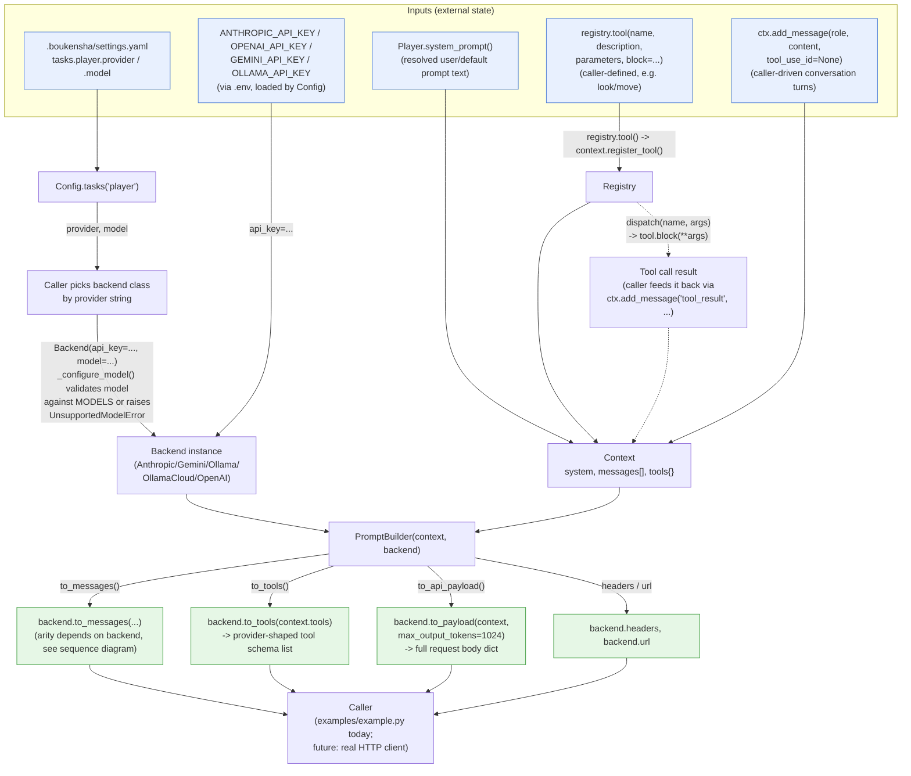
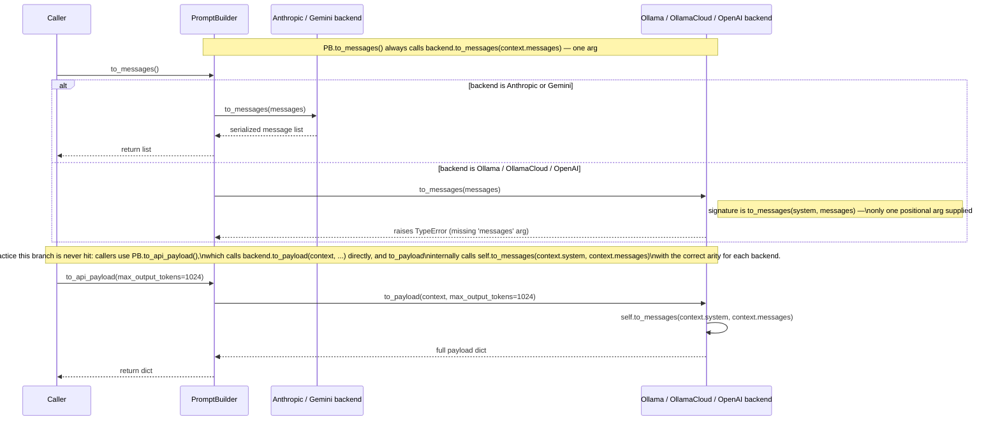

# Architecture — `boukensha` Prompt Builder (Python)

Code review summary and architecture diagram for `src/boukensha/`.

## Component overview

| Component | Responsibility |
|---|---|
| **`Config`** (`config.py`) | Resolves the `.boukensha` directory, loads `.env`, parses `settings.yaml`, exposes `tasks()`/`dig()`/`mud_*` accessors. Unchanged from the prior snapshot. |
| **`Base` / `Player`** (`tasks/base.py`, `tasks/player.py`) | Stateless task contract resolving `provider`, `model`, and system-prompt overrides from a `settings` dict. Unchanged from the prior snapshot. |
| **`Message`** (`message.py`) | Plain `@dataclass` — one conversational turn: `role`, `content`, optional `tool_use_id` (links a `"tool_result"` message back to the tool call that produced it). |
| **`Tool`** (`tool.py`) | Plain `@dataclass` — an invocable action: `name`, `description`, JSON-schema-shaped `parameters`, and a Python `block` callable that actually runs it. |
| **`Registry`** (`registry.py`) | Registers `Tool`s onto a `Context` (`registry.tool(...)`) and dispatches calls by name (`registry.dispatch(name, args)`), invoking `tool.block(**args)`. Raises `UnknownToolError` for unregistered names. |
| **`Context`** (`context.py`) | The mutable conversation state for one task run: `task`, `system` prompt, `messages: list[Message]`, `tools: dict[str, Tool]`. Owns `register_tool()`/`add_message()` and derived `tool_count`/`turn_count`. This is the thing everything downstream serializes. |
| **`backends/base.Base`** | Shared contract for provider backends: a `MODELS` registry (context window, cost per million tokens, usage unit), `validate_model()`/`model_info()` classmethods, and instance properties (`context_window`, `estimate_cost()`, etc.) populated by `_configure_model()`. |
| **`backends.Anthropic` / `.Gemini`** | Serialize a `Context` into that provider's native request shape. Both take **one** `messages` argument in `to_messages(messages)` because system prompt is sent as a separate top-level field (`system` / `systemInstruction`), not inlined into the message list. |
| **`backends.Ollama` / `.OllamaCloud` / `.OpenAI`** | Serialize a `Context` into their native shapes. All three take **two** arguments — `to_messages(system, messages)` — because their wire format wants the system prompt prepended as the first `{"role": "system", ...}` message. |
| **`PromptBuilder`** (`prompt_builder.py`) | Thin facade over a `(Context, backend)` pair: `to_messages()`, `to_tools()`, `to_api_payload(max_output_tokens=...)`, plus passthrough `headers`/`url` properties sourced from the backend. |
| **`errors.py`** | `UnknownToolError` (bad dispatch name) and `UnsupportedModelError` (backend given a model not in its `MODELS`) — both plain `Exception` subclasses. |
| **`examples/example.py`** | End-to-end smoke test: builds `Config` + `Player` system prompt, builds a `Context`, registers two tools, appends a user/assistant/tool_result turn, picks a backend by `provider` string, and prints the fully serialized API payload via `PromptBuilder`. |

Design note: `Context` is the single object every backend and `PromptBuilder` reads from — it never reaches back into `Config` or `Registry`. `Registry` is a write/dispatch-only wrapper *around* a `Context`'s `tools` dict, not a separate store. Backends are pure serializers: no network I/O happens anywhere in this folder (confirmed by `to_payload`/`headers`/`url` only ever *building* dicts/strings — no `requests`/`httpx` import exists in `src/`).

## Data flow diagram

## Backend `to_messages` arity sequence

Zooms in on `PromptBuilder.to_messages()`, the one non-trivial control-flow path in this module: a documented, intentionally-preserved arity mismatch between the facade and three of the five backends.

## Notes from review

- **Fail-fast on model validation**: `backends.base.Base._configure_model()` runs `validate_model()` in every backend `__init__`, raising `UnsupportedModelError` immediately if the given model string isn't a key in that class's `MODELS` dict — no backend can be constructed in an invalid state.
- **Preserved, documented inconsistency**: `PromptBuilder.to_messages()` always calls `backend.to_messages(context.messages)` with one argument, matching `Anthropic`/`Gemini`'s signature but not `Ollama`/`OllamaCloud`/`OpenAI`'s two-argument `to_messages(system, messages)`. The module docstring explains this is a real bug carried over from the Ruby source (also unfixed in `ruby/04_api_client`) and left as-is rather than silently "fixed" — it never fires in practice because `to_api_payload()` routes through each backend's own `to_payload()`, which calls `to_messages` with the correct arity internally. Calling `PromptBuilder.to_messages()` directly against a non-Anthropic/Gemini backend is the one latent trap in this snapshot.
- **Backends are pure serializers, no I/O**: none of the five backend classes perform a network call — `to_payload`/`headers`/`url` only build/return dicts and strings. Actually sending the request is left to a future caller (this folder has no HTTP client), consistent with the tutorial series building up incrementally.
- **Stateless-except-for-model-config backends**: unlike `Config`/`Registry`, backend instances *do* hold state (`self.model`, `self._model_info`, `self._api_key`/`self._host`) set once in `__init__` and never mutated afterward — effectively immutable value objects, not classic OO state machines.
- **`Registry` is a thin wrapper, not a parallel store**: `Registry.tool()` writes directly into `context.tools` via `context.register_tool()`; `Registry` itself holds only a reference to the `Context`, so there is exactly one source of truth for registered tools.
- **Dict-shaped tool `parameters`, not JSON Schema wrapper, at the `Tool` level**: `Tool.parameters` is a flat dict of property definitions (e.g. `{"direction": {"type": "string", ...}}`); each backend's `to_tools()` is responsible for wrapping it into that provider's expected schema envelope (`input_schema`/`parameters`/`functionDeclarations`), and for computing `required` as *all* parameter keys — there's no way to mark a parameter optional in this snapshot.
- **`tool_use_id` is overloaded across providers**: it means "the tool call this result answers" for Anthropic (`tool_use_id`) and OpenAI (`tool_call_id`), but is repurposed as the *tool name* for Ollama/OllamaCloud's `tool_name` field and Gemini's `functionResponse.name` — a `Message`'s single `tool_use_id` field is doing double duty depending on which backend reads it, which is worth knowing before adding a sixth backend.
- **No caching/cost-estimation wiring yet**: `Base.estimate_cost()` exists and is fully implemented, but nothing in this folder (backends, `PromptBuilder`, `example.py`) calls it — it's exposed API surface for a future consumer, not yet used internally.
