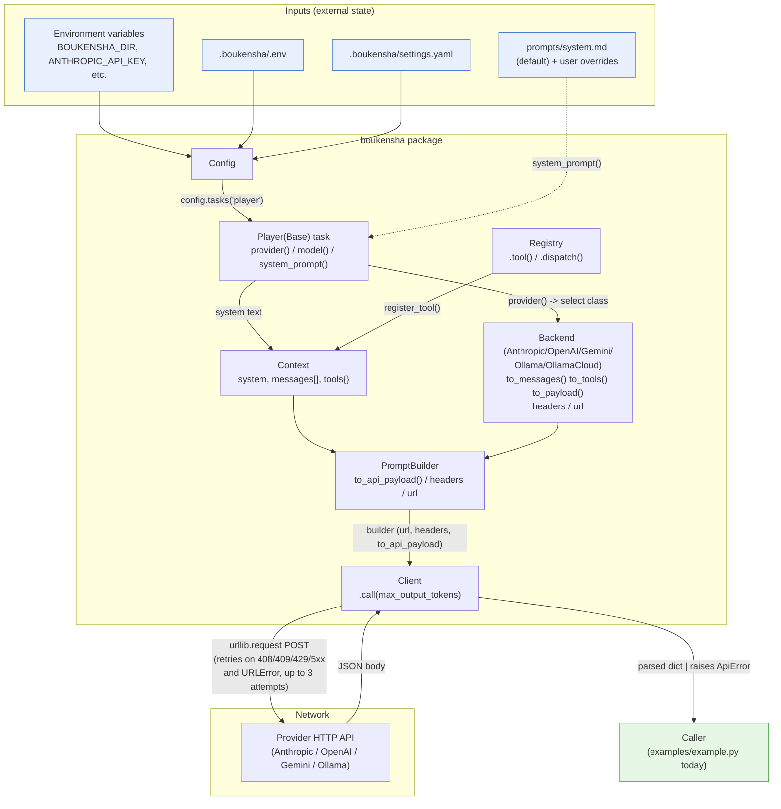
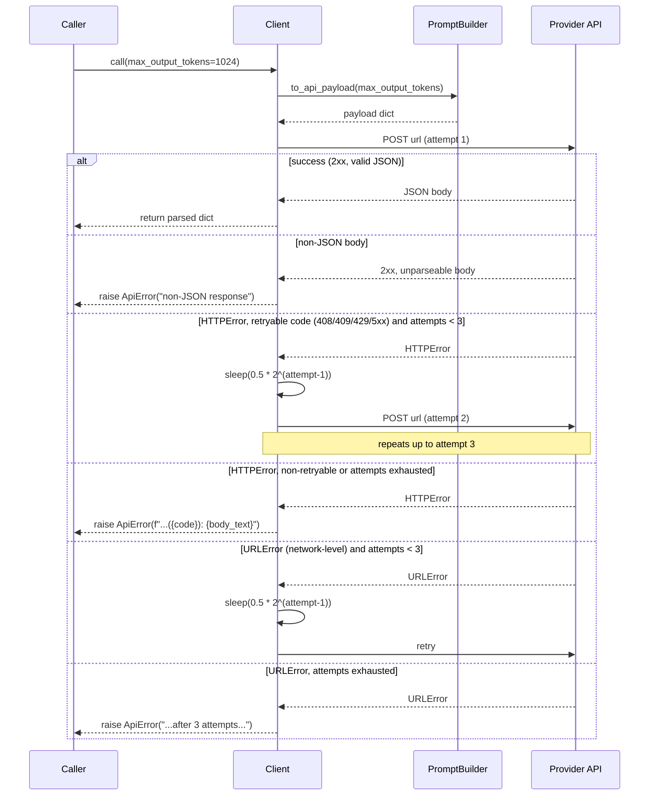

# Architecture — `boukensha` API Client (Python)

Code review summary and architecture diagram for `src/boukensha/`.

## Component overview

| Component | Responsibility |
|---|---|
| **`Config`** (`config.py`) | Unchanged from the prior snapshot: resolves the `.boukensha` directory, loads `.env`, parses `settings.yaml`, exposes `tasks()`, `dig()`, `mud_*`, and `PROMPTS_DIR`/`user_prompts_dir`. |
| **`Base`/`Player`** (`tasks/base.py`, `tasks/player.py`) | Unchanged stateless task contract: classmethods over an explicit `settings` dict, resolving `provider`, `model`, and prompt overrides. |
| **`Message`** (`message.py`) | Immutable-in-spirit `@dataclass` unit of conversation: `role`, `content`, optional `tool_use_id` (for `tool_result` messages). |
| **`Tool`** (`tool.py`) | `@dataclass` describing an invocable action: `name`, `description`, JSON-schema-style `parameters`, and a Python `block` callable. |
| **`Context`** (`context.py`) | Plain class (not a dataclass, since it has behavior) holding one conversation's state: the `task`, `system` prompt, `messages: list[Message]`, and `tools: dict[str, Tool]`. Provides `add_message()`, `register_tool()`, `tool_count`/`turn_count`. |
| **`Registry`** (`registry.py`) | Registers `Tool`s onto a `Context` (`registry.tool(...)`) and dispatches calls by name (`registry.dispatch(name, args)`), raising `UnknownToolError` for unregistered names. |
| **`backends/base.Base`** | Shared backend contract: `MODELS` class dict, `validate_model()`/`model_info()` classmethods (raise `UnsupportedModelError` on unknown model), and per-instance cost/context-window properties (`context_window`, `*_token_cost_per_million`, `estimate_cost()`). |
| **`backends/{anthropic,openai,gemini,ollama,ollama_cloud}.py`** | One class per provider, each subclassing `Base` and implementing `to_messages()`, `to_tools()`, `to_payload()`, `headers`, `url` for that provider's wire format. Anthropic/Gemini's `to_messages(messages)` takes one arg; OpenAI/Ollama/OllamaCloud's `to_messages(system, messages)` takes two — a documented, intentional cross-backend inconsistency (see `prompt_builder.py` docstring). |
| **`PromptBuilder`** (`prompt_builder.py`) | Thin adapter binding a `Context` to a backend: `to_messages()`, `to_tools()`, `to_api_payload()`, plus pass-through `headers`/`url` properties. Delegates all wire-format knowledge to the backend. |
| **`Client`** (`client.py`) — **new this folder** | The HTTP transport. Takes a `PromptBuilder`-shaped object in `__init__`, and `call(max_output_tokens=1024)` builds the payload via `builder.to_api_payload()`, POSTs it with stdlib `urllib.request` (no third-party HTTP dependency), retries transient failures, and returns the parsed JSON body. Raises `ApiError` on non-retryable failures. |
| **`errors.py`** | `UnknownToolError`, `UnsupportedModelError` (unchanged), plus **new** `ApiError` for HTTP/transport failures. |
| **`examples/example.py`** | End-to-end smoke test: builds `Config` → `Player` task settings → `Context` (with tools registered) → picks a provider backend by name → `PromptBuilder` → `Client.call()`, and prints the raw response. |
| **`tests/test_client.py`** | This folder's first test file. Unit-tests `Client` in isolation against a `MagicMock` builder and mocked `urllib.request.urlopen`/`time.sleep` — no real network or backend/config wiring is exercised. |

Design note: `Client` only knows about a `builder`-shaped object (`url`, `headers`, `to_api_payload()`) — it never imports `PromptBuilder`, `Context`, or any backend directly. This keeps it trivially unit-testable with a `MagicMock` (as `test_client.py` does) and decoupled from the config/registry/prompt layers it sits downstream of.

## Data flow diagram

## `Client.call()` retry sequence

Zooms in on `Client.call()`, the one non-trivial control-flow path in this module.

## Notes from review

- **Fail-fast vs. graceful fallback boundary is unchanged from `00_config`**: `Player.provider()`/`.model()` still raise `ValueError` immediately on missing config; `Client` itself never falls back silently either — every failure path (non-JSON body, exhausted HTTP/URL retries) raises `ApiError` rather than returning `None`/`{}`.
- **Retries are transport-only, not application-level**: `Client` retries on network-level `URLError` unconditionally and on `HTTPError` only for a fixed allow-list of status codes (`408, 409, 429, 500, 502, 503, 504`). A 401/403/404 fails immediately on attempt 1 — correctly, since retrying an auth or not-found error can't succeed.
- **Exponential backoff without jitter**: `_retry_delay(attempt) = 0.5 * 2^(attempt-1)` gives `0.5s, 1s` between the 3 attempts. No jitter is added, which is fine for a tutorial client but would matter under concurrent load in production.
- **`Client` is intentionally builder-agnostic**: its constructor takes `builder: Any`, not `PromptBuilder`, and only calls `.url`, `.headers`, `.to_api_payload()` on it. This is why `tests/test_client.py` can unit-test it fully with a `MagicMock` and never construct a real `Config`/`Context`/backend — a deliberate seam for testability.
- **Known, preserved cross-backend inconsistency**: `PromptBuilder.to_messages()` always calls `backend.to_messages(self._context.messages)` with one argument, which matches Anthropic/Gemini's signature but not OpenAI/Ollama/OllamaCloud's two-argument `to_messages(system, messages)`. Calling `PromptBuilder.to_messages()` directly against those three backends would raise `TypeError`. It never surfaces in practice because `to_api_payload()` routes through each backend's own `to_payload()`, which calls its own `to_messages()` with correct arity internally — documented in `prompt_builder.py` as ported as-is from the Ruby original rather than fixed.
- **Stateless backend selection lives in the example, not the library**: `examples/example.py` does its own `if provider == "anthropic": ... elif ...` dispatch and reads API keys straight from `os.environ`; there's no backend registry/factory in `boukensha` itself yet at this snapshot — a caller must know how to construct each backend.
- **No timeout/retry configuration surface**: `MAX_RETRIES`, `BASE_RETRY_DELAY`, `REQUEST_TIMEOUT_SECONDS`, and `RETRYABLE_STATUS_CODES` are module-level constants, not constructor parameters — reasonable for this snapshot's scope, but callers can't tune retry behavior per-request without patching the module (as the tests do via `patch("boukensha.client.time.sleep")`).
- **`Base` (backend) `models()`/`model_info()` fail fast on unimplemented backends**: `NotImplementedError` if `MODELS` is `None`, `UnsupportedModelError` if the requested model isn't in `MODELS` — validated eagerly in `__init__` via `_configure_model()`, so a bad model name fails at backend construction, before any network call is attempted.
- **First test file in the series, and it's narrowly scoped**: `tests/test_client.py` only covers `Client` + `errors.py`; `Config`, `Registry`, `Context`, `PromptBuilder`, and the five backend classes remain untested at this snapshot (matching the tutorial's incremental-coverage structure).
