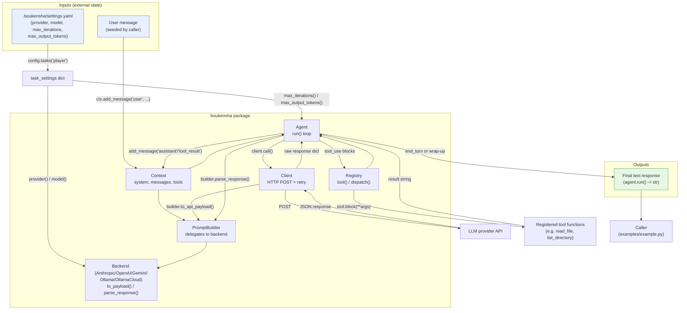
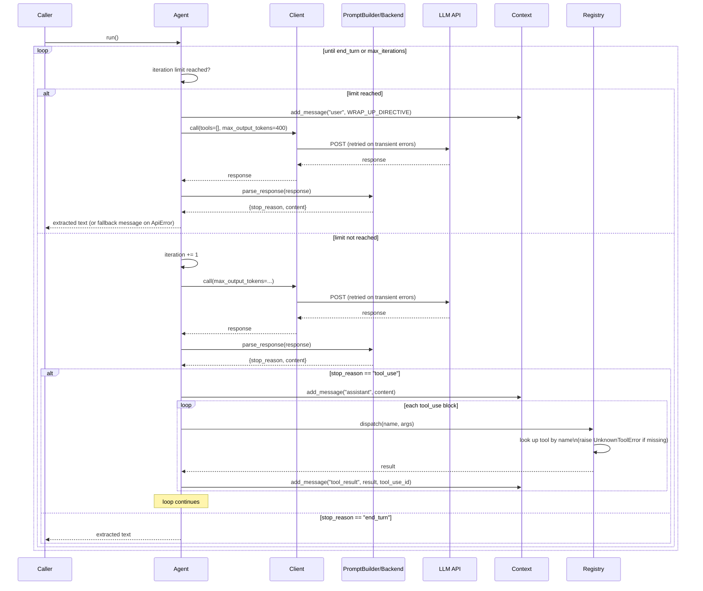

# Architecture — `boukensha` Agent Loop (Python)

Code review summary and architecture diagram for `src/boukensha/`.

## Component overview

| Component | Responsibility |
|---|---|
| **`Config`** (`config.py`) | Resolves the `.boukensha` directory, loads `.env`, parses `settings.yaml`, and exposes typed accessors (`tasks()`, `dig()`, `mud_*`). Unchanged from the `00_config` snapshot. |
| **`Base`/`Player`** (`tasks/base.py`, `tasks/player.py`) | Stateless task contract. Resolves `provider`, `model`, prompt overrides, and now also `max_iterations()`/`max_output_tokens()` (with defaults `25`/`1024`), read from the task's `settings` slice. |
| **`Tool`** (`tool.py`) | Dataclass describing one callable action: `name`, `description`, JSON-schema `parameters`, and a Python `block` (callable) that performs the action. |
| **`Message`** (`message.py`) | Dataclass for one conversation turn: `role`, `content`, optional `tool_use_id` (set only for `tool_result` messages). |
| **`Context`** (`context.py`) | Mutable conversation state: `task`, `system` prompt, `messages` list, `tools` dict. Owns `register_tool()` and `add_message()`; a plain class (not a dataclass) because it has behavior. |
| **`Registry`** (`registry.py`) | Registers `Tool`s onto a `Context` and dispatches a tool call by name (`tool.block(**args)`); raises `UnknownToolError` for an unregistered name. |
| **Backends** (`backends/base.py`, `anthropic.py`, `openai.py`, `gemini.py`, `ollama.py`, `ollama_cloud.py`) | One class per provider. Each validates its `model` against a `MODELS` table (raising `UnsupportedModelError` if unknown), and implements `to_messages()`, `to_tools()`, `to_payload()`, `parse_response()`, plus `headers`/`url` — translating the provider-neutral `Context`/`Message` shape to/from that provider's wire format. `parse_response()` normalizes every provider's reply into `{"stop_reason": "tool_use" \| "end_turn", "content": [...]}` with Anthropic-shaped content blocks (`text` / `tool_use`). |
| **`PromptBuilder`** (`prompt_builder.py`) | Thin façade that delegates `Context` serialization to whichever backend it wraps (`to_messages`, `to_tools`, `to_api_payload`, `parse_response`, `headers`, `url`). Documents an inherited upstream quirk: its own `to_messages()` calls `backend.to_messages(messages)` with one arg, which mismatches the two-arg signature some backends use internally — never triggered because `to_api_payload()` routes through each backend's own `to_payload()` instead. |
| **`Client`** (`client.py`) | Makes the HTTP POST via stdlib `urllib.request` (no third-party HTTP lib). Retries up to `MAX_RETRIES=3` with exponential backoff on retryable HTTP statuses (`408/409/429/500/502/503/504`) and on `URLError`; wraps all terminal failures in `ApiError`. |
| **`Agent`** (`agent.py`) — **new in this folder** | Drives the tool-call loop: calls the client, parses the response, dispatches any `tool_use` blocks through the `Registry`, appends `assistant`/`tool_result` messages to the `Context`, and repeats until the model returns `end_turn` or the iteration ceiling (`MAX_ITERATIONS=25`, or the task's `max_iterations`) is reached — at which point it issues one final "wrap up" call with `tools=[]`. |
| **`errors.py`** | `UnknownToolError`, `UnsupportedModelError`, `ApiError`, and (new) `LoopError` — the latter is defined but not currently raised anywhere in this snapshot; the loop ceiling is instead handled gracefully via `_wrap_up()`. |
| **`examples/example.py`** | End-to-end wiring: builds `Config` → `Player` settings → picks a backend by `provider` string → constructs `Context`/`Registry`/`PromptBuilder`/`Client`/`Agent` → registers `read_file`/`list_directory` tools → seeds a user message → runs the agent loop and prints the result. |

## Data flow diagram

## Agent loop sequence

Zooms in on `Agent.run()`, the one non-trivial control-flow path in this folder.

## Notes from review

- **Bounded loop, graceful degradation at the ceiling**: rather than raising `LoopError` (which exists in `errors.py` but is never raised in this snapshot) when `max_iterations` is hit, `Agent._wrap_up()` makes one more call with `tools=[]` to force a text-only summary, and if even that call fails (`ApiError`) it falls back to a canned message. The loop always returns a `str`, never raises on hitting the ceiling.
- **`max_iterations <= 0` disables the ceiling**: `_iteration_limit_reached()` only fires when `self._max_iterations > 0`, so a task configured with `0` (or a negative value) runs unbounded — a subtle footgun if `settings.yaml` is misconfigured.
- **Tool dispatch is fail-fast**: `Registry.dispatch()` raises `UnknownToolError` immediately for an unregistered tool name, with no fallback — a genuine bug (bad tool name from the model) surfaces loudly rather than being silently swallowed into a "tool result."
- **Client retries transient errors, fails fast on the rest**: `Client.call()` retries up to `MAX_RETRIES=3` with exponential backoff (`0.5s, 1s, ...`) only for a fixed set of retryable HTTP codes and generic `URLError`s; any other `HTTPError` (e.g. 400/401/403) raises `ApiError` on the first attempt — no wasted retries on non-transient failures.
- **Provider-agnostic core, provider-specific translation at the edges**: `Agent`, `Context`, `Registry`, `Tool`, `Message`, and `Client` know nothing about Anthropic/OpenAI/Gemini/Ollama wire formats — that translation is isolated entirely inside each `backends/*.py`'s `to_payload()`/`parse_response()`, all normalized to the same `{"stop_reason", "content"}` shape so `Agent` can treat every provider identically.
- **`PromptBuilder.to_messages()` has a latent arity bug, intentionally left in place**: it always calls `backend.to_messages(messages)` with one argument, which doesn't match the two-arg `(system, messages)` signature used internally by the Ollama/OllamaCloud/OpenAI backends. It's a no-op bug today because `to_api_payload()` never routes through `PromptBuilder.to_messages()` — each backend's own `to_payload()` calls its own `to_messages()` with the correct arity directly. Calling `PromptBuilder.to_messages()` directly with a mismatched backend would raise `TypeError`.
- **Ordering constraint in the tool-call turn**: the assistant message (containing the `tool_use` blocks) must be appended to `Context` *before* the corresponding `tool_result` messages, since providers expect a tool call to be immediately followed by its result in conversation order. `Agent._handle_tool_calls()` does this correctly (`add_message("assistant", ...)` first, then one `add_message("tool_result", ...)` per block), and `test_agent_calls_tool_then_ends` asserts this exact ordering.
- **Statelessness carried over from `Base`**: `Agent.run()` still funnels every task-specific numeric setting (`max_iterations`, `max_output_tokens`) through `Base`'s stateless classmethods via `task_settings`, rather than baking defaults into `Agent` itself — `Agent` falls back to its own module-level `MAX_ITERATIONS=25` only when no `task_settings`/task class is supplied at all (e.g. in unit tests).
