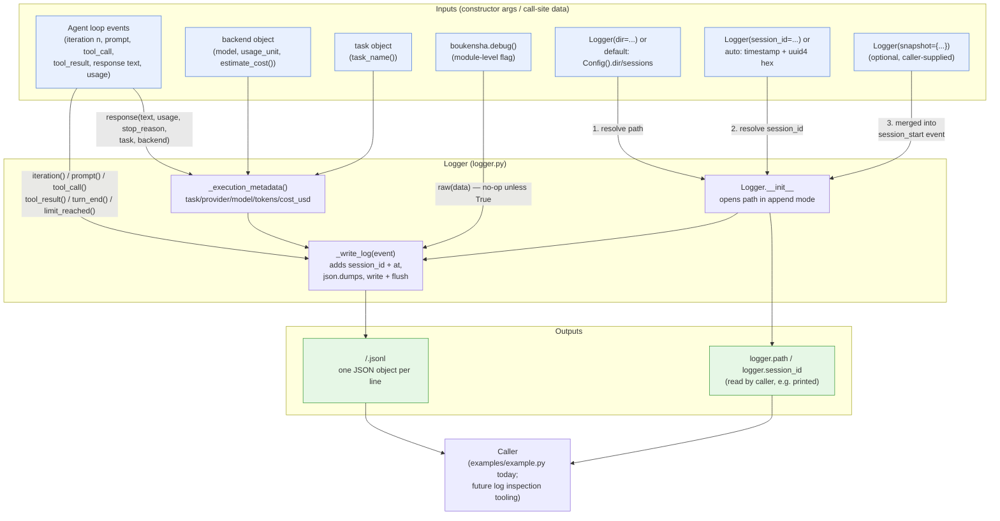
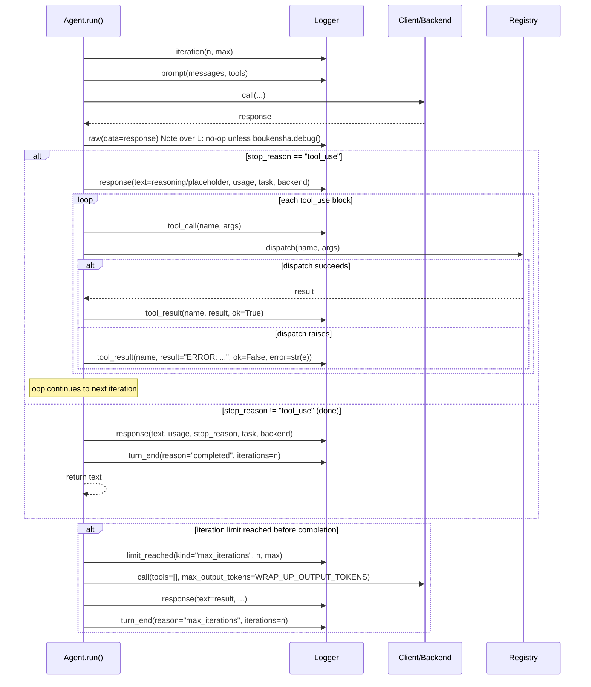

# Architecture — `boukensha` The Logger (Python)

Code review summary and architecture diagram for `src/boukensha/`.

## Component overview

| Component | Responsibility |
|---|---|
| **`Logger`** (`logger.py`) | New in this folder. Writes one JSONL file per session (`session_id.jsonl`) capturing every phase of the agent loop: `session_start`, `iteration`, `limit_reached`, `prompt`, `tool_call`, `tool_result`, `response`, `raw`, `turn_end`. Each line is stamped with `session_id` and `at` (UTC ISO timestamp) and flushed to disk immediately. |
| **`Agent`** (`agent.py`, updated) | Drives the tool-call loop as before, but now takes an optional `logger: Logger | None` kwarg (constructing a default `Logger()` if none is supplied) and calls it at every decision point: before each iteration, when the iteration ceiling is hit, before/after each model call, per tool call/result, and at turn end (both the normal-completion and wrap-up paths). |
| **`Backends`** (`backends/base.py` + per-provider) | Unchanged loop behavior, but every backend now exposes `usage_unit`, `usage_level`, and `estimate_cost(input_tokens, output_tokens)` (derived from each model's `cost_per_million` in its `MODELS` table). `Logger.response()` reads these via `getattr`/`hasattr` to attach cost/usage metadata to the `response` event without the logger needing to know about any specific backend. |
| **`Context` / `Registry` / `Client` / `PromptBuilder` / `Message` / `Tool`** | Unchanged from the prior (agent_loop) snapshot — `Context` holds messages/tools/task, `Registry` dispatches tool calls, `Client` does the retrying HTTP POST, `PromptBuilder` builds the payload and parses responses. |
| **`boukensha.debug()` / `enable_debug()`** (`__init__.py`) | Module-level mutable flag. Gates `Logger.raw()`: raw provider responses are only written to the session log when debug mode is on, keeping normal logs free of large/sensitive payloads. |
| **`examples/example.py`** | Updated smoke-test consumer: constructs a `Logger()` explicitly (no `snapshot`), passes it into `Agent(...)`, and prints `logger.path` before and after the run so the JSONL file location is visible. |

Design note: `Logger` is intentionally decoupled from every other component's internals — `Agent` hands it plain keyword data (`messages`, `tools`, `name`, `args`, `text`, `usage`, ...) rather than passing `Context`/`Backend` objects for the logger to introspect, *except* for `response()`, which does accept `task`/`backend` objects so it can pull `task_name()`, `model`, `usage_unit`, and `estimate_cost()` off them via duck-typed `getattr`/`hasattr` checks — the one place the logger reaches past its own boundary.

## Data flow diagram

## Agent-loop logging sequence

Zooms in on how `Agent.run()` drives `Logger` across one tool-calling iteration, the one non-trivial control-flow path this folder adds.

## Notes from review

- **Fire-and-forget logging, not fail-fast**: every `Logger` call site in `Agent` is guarded with `if self._logger:` — but since `Agent.__init__` always constructs a default `Logger()` when none is passed, `self._logger` is never actually falsy in practice today; the guard reads as defensive scaffolding for a future "logging disabled" mode rather than a currently reachable branch.
- **Append-only, flush-per-event durability**: `Logger.__init__` opens the file in `"a"` mode and `_write_log` calls `.flush()` after every write — no buffering, so a crash mid-run still leaves a readable partial JSONL log. The tradeoff is one `write`+`flush` syscall per event (prompt, tool_call, tool_result, response, ...), which is the right call for a debugging/audit log but would need revisiting for high-frequency use.
- **`session_start` snapshot is opt-in and currently unused**: `Logger.__init__` merges an optional `snapshot: dict` into the `session_start` event, but neither `Agent` nor `examples/example.py` ever passes one — so today's `session_start` line only ever contains `phase`, `session_id`, and `at`. Task/provider/model metadata only appears later, on `response` events, via `_execution_metadata()`.
- **Debug gate is a *runtime* check inside `raw()`, not a constructor check**: `Logger.raw()` imports `boukensha` and checks `boukensha.debug()` on every call, so toggling `enable_debug()` mid-session changes behavior for subsequent `raw()` calls on an already-constructed `Logger` — this is a deliberate global switch, not per-instance config.
- **Duck-typed execution metadata, not an interface**: `_execution_metadata()` uses `hasattr`/`getattr` to probe `backend.usage_unit`, `backend.usage_level`, `backend.model`, and `backend.estimate_cost()` rather than requiring a shared backend base class field — it degrades gracefully (keys simply omitted via `{k: v for k, v in metadata.items() if v is not None}`) if a backend lacks any of them, rather than raising.
- **Token extraction tolerates four provider usage shapes**: `_usage_tokens()` checks `input_tokens`/`prompt_tokens`/`promptTokenCount`/`prompt_eval_count` (and the output equivalents) in priority order via `_first_int`, silently returning `None` on `TypeError`/`ValueError` rather than raising — this lets the same `Logger.response()` call work unmodified across Anthropic, OpenAI, Gemini, and Ollama-shaped usage dicts.
- **Provider name derivation is a naming convention, not stored state**: `_provider_name()` regex-converts the backend's `CamelCase` class name to `snake_case` (e.g. `OllamaCloud` → `ollama_cloud`) rather than reading a declared `PROVIDER_NAME` constant — a hidden coupling: renaming a backend class silently renames its logged provider identifier too.
- **`Logger` has no `__del__`/context-manager protocol**: callers (`Agent`, `examples/example.py`) are responsible for calling `logger.close()` explicitly; nothing in `Agent.run()` closes the logger itself (the example script closes it after `agent.run()` returns), so a caller that forgets to call `close()` leaks an open file handle — acceptable for a short-lived script, worth a `with`-style wrapper if this folder's `Logger` grows into a long-running service.
- **Default log directory depends on `Config`, creating a soft coupling**: `_default_dir()` lazily imports `boukensha` and constructs a fresh `Config()` (re-resolving `BOUKENSHA_DIR`/`.env`/`settings.yaml` from scratch) purely to read `.dir` — so constructing a `Logger()` with no explicit `dir=`/`log=` implicitly depends on `Config`'s directory-resolution ordering constraints documented in `00_architecture.md`.
