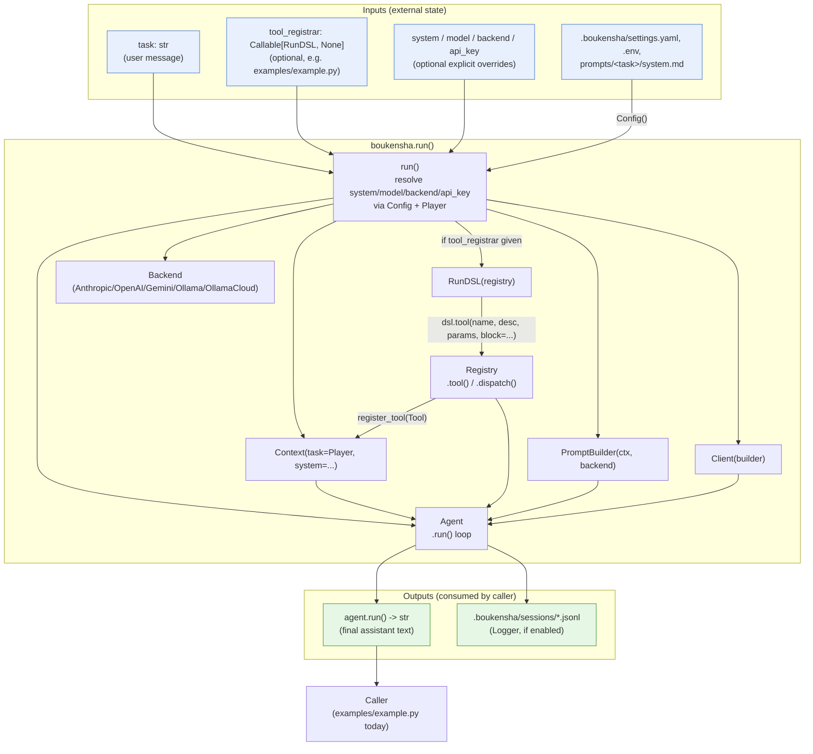
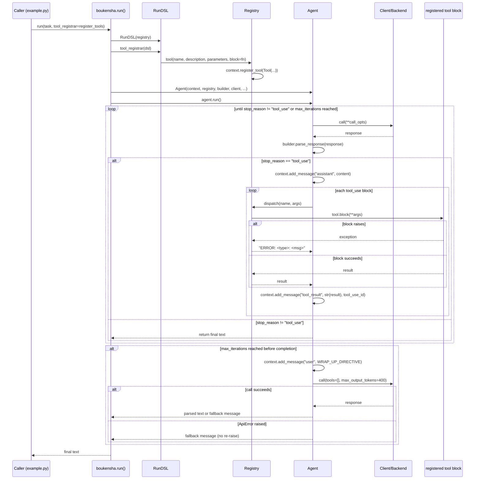

# Architecture — `boukensha` The Run DSL (Python)

Code review summary and architecture diagram for `src/boukensha/`.

## Component overview

| Component | Responsibility |
|---|---|
| **`run()`** (`__init__.py`) | The single public entry point. Wires every primitive together from a `task` string and optional overrides: resolves system prompt/model/backend/API key via `Config` + `Player`, builds a `Context`, optionally lets a caller register tools through a `RunDSL`, picks a backend, and drives an `Agent` loop to completion. |
| **`RunDSL`** (`run_dsl.py`) | The object that becomes `self` inside a tool-registration callback. Deliberately exposes only `tool(...)`, which forwards to `Registry.tool(...)` — the DSL's entire surface area is one method, so callback code cannot reach the `Context`, `Config`, or any other internal state. |
| **`Registry`** (`registry.py`) | Registers `Tool` objects onto a `Context` by name and dispatches a call by name + args (`tool.block(**args)`). Raises `UnknownToolError` for an unregistered name. |
| **`Tool`** (`tool.py`) | Plain `@dataclass` holding `name`, `description`, `parameters`, and `block` (the callable executed on dispatch). |
| **`Context`** (`context.py`) | Mutable conversation state: `task` class, `system` prompt, `messages` list, and the `tools` dict populated by `Registry`. Passed by reference into `Agent`, `PromptBuilder`, and `Registry`. |
| **`Agent`** (`agent.py`) | Drives the tool-call loop: calls the backend via `Client`, parses the response via `PromptBuilder`, executes any requested tool calls through `Registry.dispatch`, appends results back into `Context`, and repeats until the model stops calling tools or `max_iterations` is reached (triggering a one-shot "wrap up" call). |
| **`Base`/`Player`** (`tasks/`) | Unchanged from earlier steps: stateless settings resolution (`provider`, `model`, `system_prompt`, `max_iterations`, `max_output_tokens`) from a `settings` dict. |
| **`Config`**, **`Client`**, **`PromptBuilder`**, **`Logger`**, **backends** | Carried over from prior snapshots, reused unmodified by `run()` to build the pieces `Agent` needs. |
| **`examples/example.py`** | Reference consumer: defines `register_tools(dsl)` (adds `read_file`/`list_directory` tools via the DSL) and calls `boukensha.run(task=..., tool_registrar=register_tools)`. |

Design note: `RunDSL` is the *only* new surface this folder adds on top of the `06`-era agent loop. Its job is purely translation — DSL method call → `Registry` call — so that a caller's tool-registration closure can never see `Context`, `Config`, or the `Agent` itself, only the narrow `tool()` verb.

## Data flow diagram

## Agent loop sequence

Zooms in on `Agent.run()`, the one non-trivial control-flow path this folder exercises end to end — including how a `RunDSL`-registered tool gets invoked mid-loop.

## Notes from review

- **DSL is a thin capability boundary, not a language**: `RunDSL` has exactly one method (`tool`). It is called a "DSL" because it's the object bound as `self` inside the caller's registration callback, but there is no parsing, grammar, or execution engine here — it's a deliberately narrow façade over `Registry.tool()` that prevents the callback from touching `Context`/`Config` directly.
- **Tool dispatch failures are caught and turned into tool results, not exceptions**: `Agent._handle_tool_calls` wraps `registry.dispatch(...)` in a broad `except Exception`, converting any failure (including a raised `UnknownToolError`) into a string `"ERROR: ..."` fed back to the model as a `tool_result` message — the loop never crashes because one tool call failed; the model gets a chance to recover.
- **Two different fail-fast/fallback postures in the same loop**: the main iteration loop calls the backend and lets exceptions propagate (fail-fast — a genuine API failure mid-turn is not swallowed), but the `_wrap_up` call specifically catches `ApiError` and substitutes a canned fallback message — a deliberate asymmetry: the wrap-up call is best-effort ("tell the user you ran out of turns") and must never itself throw and mask the real limit-reached condition.
- **`max_iterations <= 0` disables the ceiling entirely**: `_iteration_limit_reached` is `self._max_iterations > 0 and self._iteration >= self._max_iterations`, so a `max_iterations` of `0` (or a negative value) makes the guard always `False` — an easy-to-miss escape hatch if `settings.yaml` is misconfigured.
- **`Registry`/`Context`/`Tool` remain stateless-by-construction where possible, but `Context` is intentionally mutable**: unlike `Config`/`Base`, `Context` is a plain class carrying live `messages`/`tools` state that `Agent` mutates in place across iterations — a deliberate departure from the statelessness pattern established in earlier folders, needed because a running conversation *is* state.
- **`run()` re-derives task settings from `Config()` on every call, ignoring any previously constructed `Context`**: there's no caching — each call to `boukensha.run()` freshly resolves `.boukensha/settings.yaml`, `.env`, and prompt files, so config-file edits take effect on the next call without restarting a process (useful for the REPL-style consumers this DSL anticipates in later folders).
- **Backend selection is a hard-coded `if/elif` chain, not a registry lookup**: `run()` maps `resolved_backend` strings to backend classes with an `if/elif/else raise ValueError`; adding a new backend requires editing `run()` itself rather than registering a provider elsewhere — fine at five backends, but a maintenance point to watch.
- **The `finally: logger.close()` guarantees the JSONL log is flushed even when `agent.run()` raises**, keeping `run()`'s side effect (a log file) consistent with its return-or-raise contract.
