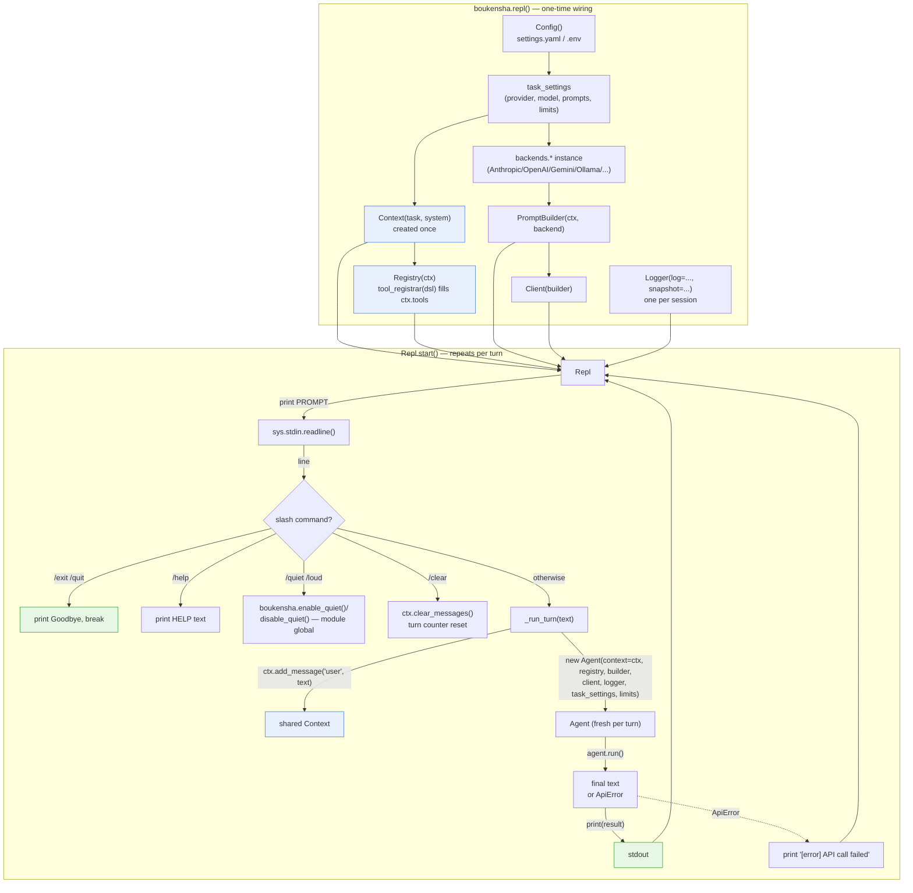

# Architecture — `boukensha` The REPL Loop (Python)

Code review summary and architecture diagram for `src/boukensha/`.

## Component overview

| Component | Responsibility |
|---|---|
| **`boukensha.run()`** (`__init__.py`) | One-shot entry point: wires `Config` → task settings → `Context` → `Registry`/tools → a `backends.*` instance → `PromptBuilder` → `Client` → `Logger` → `Agent`, adds the single user message, and returns the agent's final text. Unchanged from prior snapshots. |
| **`boukensha.repl()`** (`__init__.py`) | New entry point for this folder. Performs the *identical* wiring to `run()` (deliberately duplicated, not shared — see Notes) but hands the assembled primitives to a long-lived `Repl` instead of an `Agent`, and calls `.start()`. Catches `KeyboardInterrupt` at the top level and always closes the `Logger`. |
| **`Repl`** (`repl.py`) | The interactive read-eval-print loop. Reads a line from `sys.stdin`, dispatches slash-commands (`/exit`, `/quit`, `/help`, `/quiet`, `/loud`, `/clear`) or otherwise treats the line as a task and drives one `Agent` turn. Owns turn numbering and prints a startup banner. |
| **`Agent`** (`agent.py`) | Drives the tool-call loop for a *single* turn until the model stops calling tools, the wrap-up path fires, or `max_iterations` is reached. Instantiated fresh by `Repl` for every turn — see Notes. |
| **`Context`** (`context.py`) | Mutable conversation state: `task`, `system`, `messages`, `tools`. Created once per REPL session (not per turn) so history and registered tools persist across turns; `Repl./clear` truncates `messages` back to empty without touching `tools`. |
| **`Registry`** (`registry.py`) | Holds `Context.tools` and dispatches a tool call by name, invoking the stored block with keyword args. Shared across turns like `Context`. |
| **`PromptBuilder`** / **`Client`** / **backends** | Unchanged from the prior "run DSL" snapshot: `PromptBuilder` delegates serialization to whichever backend is configured; `Client` does the retrying HTTP POST via stdlib `urllib`; a `backends.*` class (Anthropic/OpenAI/Gemini/Ollama/OllamaCloud) encodes provider-specific payload/parsing. |
| **`Logger`** (`logger.py`) | Structured JSONL session writer. One `Logger` per REPL session (not per turn), so all turns of an interactive session land in the same log file. `Repl.start()` calls `self._logger.turn(n=...)` at the start of each turn on top of the per-iteration events `Agent` already emits. |
| **`is_quiet()` / `enable_quiet()` / `disable_quiet()`** (`__init__.py`) | Process-wide (module-global) boolean flag, not per-`Repl` or per-`Context` state — see Notes. `/quiet` and `/loud` toggle it; `Agent` checks it before printing iteration/tool-call progress lines. |
| **`examples/example.py`** | Smoke-test / reference consumer: sets `BOUKENSHA_DIR`, registers `read_file`/`list_directory` tools scoped to the sibling `07_the_run_dsl` folder, and calls `boukensha.repl(tool_registrar=register_tools)` to start an interactive session. |

## Data flow diagram



## Read-eval-print turn sequence

Zooms in on one non-command turn of `Repl.start()` — the one non-trivial control-flow path added by this folder, showing how the shared `Context` and a per-turn `Agent` interact with the tool-call loop and `Logger`.

```mermaid
sequenceDiagram
    participant U as User (stdin)
    participant R as Repl
    participant C as Context (shared)
    participant A as Agent (new per turn)
    participant Cl as Client/backend
    participant Reg as Registry
    participant L as Logger (shared)

    U->>R: line of text (not a slash command)
    R->>R: _turn += 1
    R->>L: turn(n=self._turn)
    R->>C: add_message("user", text)
    R->>A: Agent(context=C, registry, builder, client, logger, task_settings, limits)
    A->>A: _iteration = 0 (fresh budget this turn)
    loop until stop_reason != tool_use or max_iterations reached
        A->>L: iteration(n, max) / prompt(messages, tools)
        A->>Cl: client.call(**opts)
        Cl-->>A: response (raises ApiError after MAX_RETRIES)
        A->>A: builder.parse_response(response)
        alt stop_reason == "tool_use"
            A->>C: add_message("assistant", content)
            loop each tool_use block
                A->>Reg: dispatch(name, args)
                Reg-->>A: result (or caught Exception -> "ERROR: ...")
                A->>C: add_message("tool_result", result, tool_use_id)
            end
        else stop_reason == end_turn
            A->>C: add_message("assistant", text)
            A-->>R: return text
        end
    end
    alt max_iterations reached
        A->>C: add_message("user", WRAP_UP_DIRECTIVE)
        A->>Cl: client.call(tools=[], max_output_tokens=WRAP_UP_OUTPUT_TOKENS)
        Cl-->>A: response or ApiError (caught -> fallback message)
        A->>C: add_message("assistant", result)
        A-->>R: return result
    end
    R->>U: print() ; print(result)
    Note over R,U: on ApiError escaping agent.run(),<br/>Repl prints "[error] API call failed" and loops again
```

## Notes from review

- **Fresh `Agent` per turn, shared everything else**: `Repl._run_turn` constructs a brand-new `Agent` for every line of input, but passes it the *same* `Context`, `Registry`, `PromptBuilder`, `Client`, and `Logger` instances held by the `Repl`. This means conversation history accumulates turn over turn (via the shared `Context.messages`), but each turn gets a full, un-decremented `max_iterations` budget (`Agent._iteration` starts at `0` again) — the tool-call loop can never "run out" across turns, only within one.
- **Quiet mode is process-global state, not session state**: `is_quiet()`/`enable_quiet()`/`disable_quiet()` operate on a single module-level `_quiet` boolean in `boukensha/__init__.py`, not an attribute of `Repl` or `Context`. `Agent` consults it directly (`if not boukensha.is_quiet(): print(...)`). This is convenient for a single-process REPL but means the flag leaks across any other concurrent use of the `boukensha` module in the same process — the test suite (`test_quiet.py`, `test_repl.py`) has to manually reset `boukensha._quiet = False` in setup/teardown to avoid cross-test pollution.
- **Two layers of error handling around `ApiError`**: `Agent._wrap_up()` already catches `ApiError` internally when the iteration ceiling is hit, falling back to a canned "I reached my N-action limit" message so a turn always returns *some* text. `Repl._run_turn` adds an outer `try/except ApiError` around `agent.run()` as a second line of defense for retryable-exhausted failures that occur during a *normal* (non-wrap-up) iteration — in that case the REPL prints an inline `[error]` line and loops back to the prompt rather than crashing the session.
- **Blank input is a no-op, not a wasted turn**: `Repl.start()` strips and checks the line before dispatching; empty or whitespace-only input neither increments the turn counter, adds a message, nor triggers an API call — confirmed by `test_repl_skips_blank_lines`.
- **EOF ends the loop silently**: `sys.stdin.readline()` returning `""` (empty string, distinct from a blank line with a trailing newline) breaks the `while True` loop without printing "Goodbye" — this is what lets tests feed a finite `io.StringIO` and have `repl.start()` return cleanly even without an explicit `/exit`.
- **`/clear` clears messages but not tools**: `Context.clear_messages()` resets `self.messages = []`; `Repl` additionally resets its own `self._turn = 0`. Registered tools (`Context.tools`) are untouched — intentional per the module docstring ("wipe conversation history (tools stay)").
- **`KeyboardInterrupt` is handled one level up from `Repl`**: `Repl.start()` has no `try/except KeyboardInterrupt` of its own; `boukensha.repl()` wraps `_Repl(...).start()` in a `try/except KeyboardInterrupt: print("\nInterrupted.")` with a `finally: logger.close()`. A Ctrl-C during `sys.stdin.readline()` or mid-turn therefore always exits the whole `repl()` call cleanly and still flushes/closes the log file.
- **`run()` and `repl()` wiring is intentionally duplicated**: the `__init__.py` comment above `repl()` states this is deliberate ("Each step is a self-contained snapshot... intentionally mirrors run() rather than sharing a helper") so this folder can be read in isolation without chasing a shared helper defined elsewhere — a documented trade-off of tutorial-snapshot repos over DRY production code.
- **One `Logger` and one `Context` per REPL session, not per turn**: unlike `Agent`, both are constructed once in `boukensha.repl()` and threaded through every `Repl._run_turn` call, so the JSONL log accumulates `turn`/`iteration`/`prompt`/`tool_call`/`tool_result`/`response` events from every turn of the session in a single file, and `Context.messages` is the one true accumulating conversation transcript.
- **API-key banner check is a presence check, not validation**: `Repl._banner()` shows "API key set" purely from `self._api_key and self._api_key.strip()` being truthy — it never attempts a call to confirm the key is valid; an invalid key still shows "set" and only surfaces as an `ApiError` on the first real turn.
