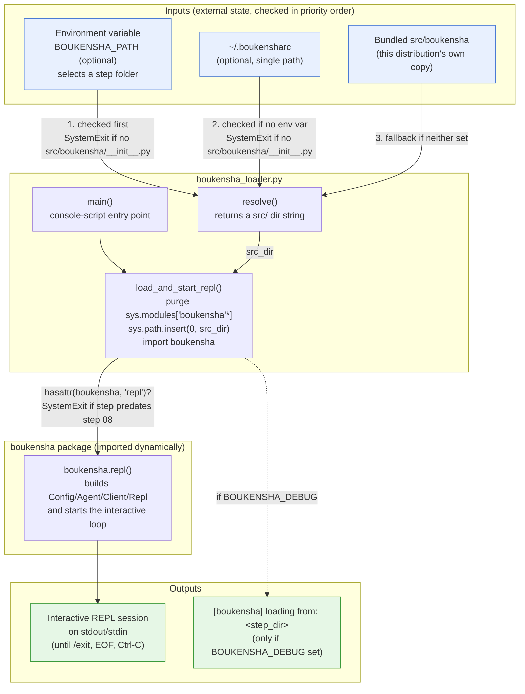
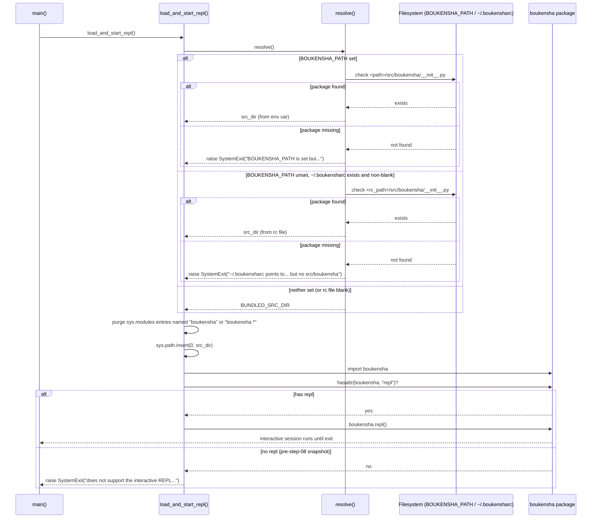

# Architecture — `boukensha` Global Executable (Python)

Code review summary and architecture diagram for `src/boukensha_loader.py` and the `boukensha` console-script entry point that wraps the bundled `src/boukensha/` package (step 8's REPL, unchanged).

## Component overview

| Component | Responsibility |
|---|---|
| **`[project.scripts]`** (`pyproject.toml`) | Registers the `boukensha` console script, mapping it to `boukensha_loader:main`. `[tool.hatch.build.targets.wheel]` bundles both `src/boukensha/**` and `src/boukensha_loader.py` into the installable wheel, so a `uv tool install --editable .` (or plain `uv run boukensha`) puts a real executable on `$PATH`. |
| **`boukensha_loader`** (`src/boukensha_loader.py`) | Lives *outside* the `boukensha` package on purpose, since it's the piece that decides which `boukensha` package gets imported. Exposes `resolve()` (pick a `src/` dir), `load_and_start_repl()` (mutate `sys.path`/`sys.modules`, import, and call `.repl()`), and `main()` (the console-script target). |
| **`boukensha` package** (`src/boukensha/`) | Bundled default distribution — identical to step 8's `repl_loop` snapshot (`Config`, `Agent`, `Client`, `Repl`, backends, tasks, etc.). Documented in earlier steps' architecture docs; here it is treated as an opaque module that must expose a `repl` attribute. |
| **`tests/test_boukensha_loader.py`** | Unit-level tests against `resolve()` / `load_and_start_repl()` / `main()`, using `monkeypatch` to fake `BOUKENSHA_PATH`, `~/.boukensharc`, and `Path.home()`, plus a fake `boukensha` package with/without a `repl` attribute. |
| **`tests/test_console_script.py`** | End-to-end tests that actually `subprocess.run()` the installed `.venv/bin/boukensha` binary, feeding stdin and asserting on stdout/stderr/returncode — the only test file exercising the real entry point rather than the Python API. |

Design note: `boukensha_loader` owns *which package gets imported and from where*; the `boukensha` package itself owns *what the REPL does once running* — the loader never inspects or depends on `boukensha` internals beyond checking `hasattr(boukensha, "repl")`.

## Data flow diagram

## Step-resolution sequence

Zooms in on `resolve()` → `load_and_start_repl()`, the one non-trivial control-flow path added by this step: three fallback sources, each independently able to fail fast.

## Notes from review

- **Fail-fast on explicit misconfiguration, silent fallback on absence**: if `BOUKENSHA_PATH` or `~/.boukensharc` is *set* but points somewhere without `src/boukensha/__init__.py`, `resolve()` raises `SystemExit` with an actionable message rather than silently falling through to the bundled default — a wrong explicit choice should be surfaced, not masked. A genuinely *unset* env var or *absent/blank* rc file, however, falls through quietly to `BUNDLED_SRC_DIR`, since "nothing configured" is the expected common case.
- **Environment variable wins over the rc file, which wins over the bundle**: `resolve()` checks `BOUKENSHA_PATH` first, then `~/.boukensharc`, then falls back to the bundled `src/`. This lets a one-off `BOUKENSHA_PATH=... boukensha` override a permanent `~/.boukensharc` default without editing it, tested explicitly in `test_resolve_env_var_wins_over_boukensharc`.
- **Two distinct env vars with easily confused names**: `BOUKENSHA_PATH` selects *which step's `boukensha` package* to import (a code-selection knob, new in this step); `BOUKENSHA_DIR` (consumed later by `Config`, unchanged from step 00) selects *where the config/settings live*. The loader never touches `BOUKENSHA_DIR` itself — it's forwarded implicitly because `Config()` reads it from `os.environ` when `boukensha.repl()` runs.
- **Manual `sys.modules` purge before every load**: `load_and_start_repl()` deletes any previously imported `boukensha`/`boukensha.*` modules before inserting the new `src_dir` at the front of `sys.path`. This is necessary because Python caches modules by name — without the purge, re-invoking `load_and_start_repl()` in the same process (as the test suite does, switching between fake step directories) would keep returning the first-imported package regardless of `BOUKENSHA_PATH`. Production usage (`main()` runs once per process) wouldn't need this, but it's what makes the loader safely re-callable and testable.
- **`sys.path.insert(0, ...)` is prepend, never removed**: the chosen `src_dir` is inserted at the *front* of `sys.path` and never popped, so it takes priority over any other `boukensha`-named import for the rest of the process; tests compensate by manually filtering `fake_step/src` entries back out (`_clear_boukensha_modules`) to avoid cross-test pollution — a sign this is a deliberately process-lifetime, not call-scoped, side effect.
- **Capability probing over version numbers**: rather than checking a step number or version string, the loader does a plain `hasattr(boukensha, "repl")` to decide whether the resolved package supports the interactive loop, then raises `SystemExit` with a pointer to run `examples/*.py` directly instead. This ties the check to the actual API surface rather than a step-folder naming convention, so it keeps working even if step folders get renamed or renumbered.
- **The loader is a thin, standalone module by design**: the docstring explicitly notes it lives outside `boukensha` "on purpose" — it can't be part of the package it's choosing between. It has zero dependency on `boukensha` internals beyond the `repl` attribute check, which keeps it stable across every future step that adds to the package.
- **Two test tiers for two different guarantees**: `test_boukensha_loader.py` exercises `resolve()`/`load_and_start_repl()` in-process with monkeypatched fakes (fast, covers edge cases like blank rc files and env-vs-rc precedence); `test_console_script.py` instead `subprocess.run()`s the real installed `.venv/bin/boukensha` binary end-to-end, which is the only place that verifies the `[project.scripts]` wiring in `pyproject.toml` actually produces a working executable — a unit test importing `boukensha_loader.main` could pass even if the entry-point registration itself were broken.
