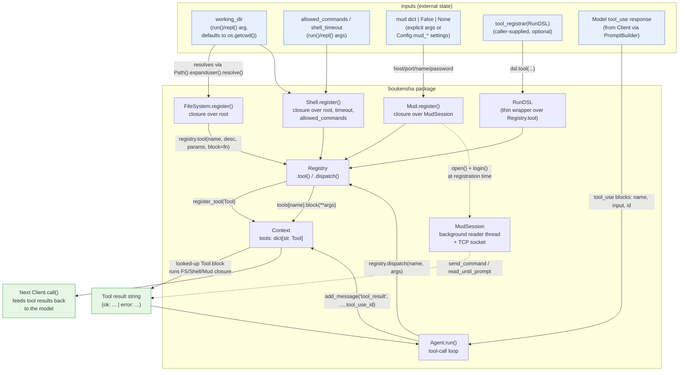

# Architecture — `boukensha` Standard Tool Library (Python)

Code review summary and architecture diagram for `src/boukensha/`, focused on the
new `src/boukensha/tools/` package (`file_system.py`, `mud.py`, `shell.py`) and how it
plugs into the existing `Tool`/`Registry`/`Context`/`Agent` core.

## Component overview

| Component | Responsibility |
|---|---|
| **`Tool`** (`tool.py`) | Unchanged dataclass: `name`, `description`, `parameters`, `block` — the auto-`__init__` container every registered tool becomes. |
| **`Registry`** (`registry.py`) | Unchanged dispatcher: `.tool(...)` registers a `Tool` on a `Context`, `.dispatch(name, args)` looks it up and calls `tool.block(**args)`, raising `UnknownToolError` if missing. Every tool module in this folder builds *on top of* this same registration API — none of them bypass it. |
| **`Context`** (`context.py`) | Unchanged holder of `task`, `system`, `working_dir`, `messages`, and the `tools: dict[str, Tool]` map that `Registry.register_tool` writes into. |
| **`FileSystem`** (`tools/file_system.py`) | Registers six sandboxed file tools (`pwd`, `list_directory`, `read_file`, `write_file`, `delete_file`, `search_files`) against a `working_dir` root, resolved once at `register()` time. Every path argument is re-resolved and boundary-checked per call via a closure over `root`. |
| **`Shell`** (`tools/shell.py`) | Registers a single `run_command` tool that runs a string through `subprocess.run(..., shell=True, cwd=root)` with a timeout and an optional executable allow-list. |
| **`Mud`** (`tools/mud.py`) | Registers ~25 MUD gameplay tools (connection, perception, movement, combat, communication, inventory, magic, utility) that all funnel through one shared `MudSession` captured by closure, plus a background-thread `MudSession` class that maintains a raw telnet/TCP connection to a CircleMUD server. |
| **`boukensha.run()` / `boukensha.repl()`** (`__init__.py`) | The wiring functions: build a `Context`/`Registry`, conditionally call `FileSystem.register`, `Shell.register`, `Mud.register` based on `working_dir`/`mud` arguments, optionally run a user-supplied `tool_registrar(RunDSL)`, then hand everything to `Agent`. |
| **`RunDSL`** (`run_dsl.py`) | Unchanged minimal DSL surface (`tool()` only) exposed to a caller-supplied `tool_registrar` callback, so custom tools can be added alongside the three built-in modules without touching `Registry` directly. |
| **`Agent`** (`agent.py`) | Unchanged tool-call loop: parses each model response, and for every `tool_use` block calls `Registry.dispatch(name, args)`, catching any exception and feeding `f"ERROR: {type}: {msg}"` back to the model as the tool result rather than crashing the turn. |

Design note: the three tool modules (`FileSystem`, `Shell`, `Mud`) are independent,
mutually unaware registrars — each exposes a single `register(registry, **opts)`
classmethod/staticmethod that closes over whatever private state it needs (a `root`
path, a `MudSession`) and hands plain functions to `registry.tool(...)`. `Registry`
and `Agent` never know these tools exist as a category; they only ever see
`Tool` objects with a `name` and a `block`.

## Data flow diagram



## MUD auto-connect and dispatch sequence

Zooms in on the one non-trivial control-flow path introduced in this folder:
`Mud.register()`'s auto-connect-at-registration behavior, followed by a
representative guarded tool call (`move`) going through `Agent`/`Registry`.

```mermaid
sequenceDiagram
    participant Run as boukensha.run()
    participant Mud as Mud.register()
    participant Sess as MudSession
    participant Srv as MUD server (socket)
    participant Agent as Agent._handle_tool_calls
    participant Reg as Registry.dispatch

    Run->>Mud: Mud.register(registry, host, port, name, password)
    Mud->>Reg: registry.tool("mud_connect"/"move"/... , block=lambda)
    Mud->>Sess: session.open()
    Sess->>Srv: socket.create_connection()
    Sess->>Sess: start background reader thread
    Mud->>Sess: session.login(name, password)
    Sess->>Srv: wait "wish to be known" -> send name
    Sess->>Srv: wait "Password" -> send password
    alt "Wrong password"
        Sess-->>Mud: raise RuntimeError
        Mud->>Mud: except Exception -> warnings.warn(...)
        Note over Mud: registration continues;<br/>tools remain registered but session stays closed
    else "Welcome"
        Sess->>Srv: send "" then "1" (enter game)
        Sess-->>Mud: drained welcome text
    end

    Note over Run,Reg: ... later, during Agent.run() ...
    Agent->>Reg: dispatch("move", {"direction": "north"})
    Reg->>Reg: tool = tools["move"]
    Reg->>Sess: tool.block(direction="north")
    Note over Sess: block = _guard(session) or _send(...)
    alt session not open
        Sess-->>Reg: "error: not connected — call mud_connect first"
    else session open, direction invalid
        Sess-->>Reg: "error: invalid direction: ..."
    else session open, direction valid
        Sess->>Srv: send_command("north")
        Srv-->>Sess: response text (buffered by reader thread)
        Sess-->>Reg: read_until_prompt() text
    end
    Reg-->>Agent: result string
    Agent->>Agent: add_message("tool_result", result, tool_use_id)
```

## Notes from review

- **Graceful fallback on MUD auto-connect failure**: `Mud.register()` wraps its
  `session.open()`/`session.login()` call in `try/except Exception` and only
  `warnings.warn(...)` on failure — registration always succeeds and every MUD
  tool remains callable, but each will return the guard error
  `"error: not connected — call mud_connect first"` until `mud_connect` is
  invoked manually. This differs from `Base.provider()`/`Base.model()`'s
  fail-fast `ValueError` in `00_config` — a connectivity problem at startup is
  treated as recoverable, not fatal.
- **Fail-fast inside `Agent._handle_tool_calls`, not inside the tools**: none of
  the three tool modules raise on bad input for *routing* purposes — they all
  return `"error: ..."` strings (`FileSystem._oops`, `Shell._oops`,
  `Mud._check_enum`/`_guard`) so a bad tool call becomes normal conversational
  content the model can react to, rather than an exception. `Agent` still has a
  defensive `try/except Exception` around `registry.dispatch(...)` for the one
  case that *does* raise: `Registry.dispatch` on an unknown tool name
  (`UnknownToolError`) — that's the only exception path tools are expected to
  trigger.
- **Path sandboxing is closure-captured, not re-validated by the caller**:
  `FileSystem.register`/`Shell.register` resolve `root` once via
  `Path(working_dir).expanduser().resolve()` at registration time; every
  subsequent call re-resolves the *argument* path against that fixed `root`
  and checks `absolute == root or absolute.startswith(root + os.sep)` before
  touching disk. A tool cannot escape the working directory even if the model
  passes `../../etc/passwd` — but the check happens per-call inside the
  closure, not centrally in `Registry`, so any future tool module that skips
  this pattern would not be sandboxed by default.
- **Shell allow-list is best-effort, not a real sandbox**: `run_command`
  still executes with `shell=True`, so the allow-list only checks the first
  `shlex`-split token against `allowed_commands`; shell metacharacters
  (`;`, `&&`, `|`, backticks) inside `command` are not filtered and can chain
  additional commands past the check. This is a real gap worth flagging, not
  a design the code claims to close.
- **`MudSession` is deliberately stateful and long-lived**, unlike the
  stateless `Base`/`Player` task classes from `00_config` — it owns a raw
  socket, a background daemon thread, and mutable buffers guarded by a
  `threading.Lock`/`threading.Event`. It is intentionally shared by every MUD
  tool via closure (one login per process, not per call) — the doctring in
  `mud.py` calls this out explicitly.
- **Silent thread-error swallowing in `MudSession._read_loop`**: the bare
  `except Exception: pass` (comment: "e.g., mock objects in tests that lack
  fileno()") deliberately does *not* mark the session closed on unexpected
  errors, to keep unit tests that inject fake sockets from tripping the
  disconnect path — a test-driven exception to the otherwise fail-visible
  `except (OSError, ConnectionResetError): self._closed = True` branch above
  it.
- **Enum-style validation is duplicated per MUD tool, not centralized**:
  `_check_enum(value, allowed_set, name)` is called individually inside nearly
  every `_verb(...)` helper (`_move`, `_attack`, `_set_position`, ...) rather
  than declared once in the `parameters` schema — the schema's `description`
  strings document the allowed values for the model's benefit, but enforcement
  is still runtime Python, consistent with the same "schema is documentation,
  not validation" pattern used by `FileSystem`/`Shell`.
- **Tool registration order matters for description text, not behavior**:
  `boukensha.run()`/`repl()` register `FileSystem` and `Shell` before `Mud`
  (both gated on `resolved_wd` truthiness, `Mud` gated on `resolved_mud`
  truthiness) and then apply any `tool_registrar` last — since `Context.tools`
  is a plain `dict[str, Tool]` keyed by name, a caller-supplied tool with a
  name collision (e.g. redefining `read_file`) silently overwrites the
  built-in, since `register_tool` does an unconditional `self.tools[tool.name]
  = tool`.
