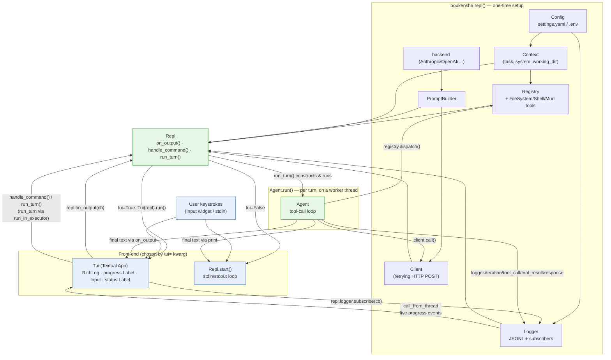

# Architecture — `boukensha` TUI (Python)

Code review summary and architecture diagram for `src/boukensha/`, focused on step 11's new piece: `tui.py`, a [Textual](https://github.com/Textualize/textual) terminal UI that wraps the `Repl` loop introduced in the prior step. Everything below `Repl`/`Agent` (backends, tools, `Config`, `Registry`, `PromptBuilder`, `Client`) is unchanged plumbing carried over from `10_standard_tool_library` and is summarized only as context for how the TUI drives it.

## Component overview

| Component | Responsibility |
|---|---|
| **`Tui`** (`tui.py`) | New. A `textual.app.App` subclass that replaces `Repl`'s raw `print`/`input` I/O with a four-zone layout: scrollable `RichLog` (conversation), a live `progress` `Label` (spinner/iteration/tokens/tool-calls), an `Input` box, and an always-on `status` `Label` (version · model · context tokens · tool count · clock). It never touches the agent loop directly — it only drives `Repl`'s composable API. |
| **`Repl`** (`repl.py`) | Refactored for composability: `on_output(callback)` reroutes all output through a callback instead of `print`; `handle_command(text)` parses slash commands (`/exit`, `/quit`, `/help`, `/quiet`, `/loud`, `/clear`) and returns `"quit"` / `"command"` / `None`; `run_turn(text)` runs one `Agent` turn and emits its result via the output callback. `start()` (the plain-REPL entry point from step 10) is now built out of these same primitives, so `tui=False` and the `Tui` share one code path underneath. |
| **`Logger`** (`logger.py`) | Extended with `subscribe(callback)`. Every JSONL event written by `_write_log` (iteration, tool_call, tool_result, response, turn_end, limit_reached, …) is now also broadcast synchronously to all subscribers, in addition to being appended to the session file. `Tui` is the only current subscriber. |
| **`Agent`** (`agent.py`) | Unchanged tool-call loop: calls the client, parses the response, dispatches tool calls through `Registry`, and appends messages to `Context` until the model stops or `max_iterations` is hit (then asks for a wrap-up reply). This is what actually produces the events `Tui` displays live. |
| **`boukensha.repl()`** (`__init__.py`) | Wires `Config` → `Context` → `Registry` (+ `FileSystem`/`Shell`/`Mud` tools) → backend → `PromptBuilder` → `Client` → `Logger` → `Repl`, exactly as in step 10, then gained a `tui: bool = True` keyword: `True` constructs `Tui(repl_instance)` and calls `.run()`; `False` calls `repl_instance.start()` directly (no Textual import touched on that path). `Tui` itself is lazily imported via `__getattr__` in `__init__.py` so importing `boukensha` doesn't require Textual unless `Tui`/`tui=True` is actually used. |
| **`boukensha_loader.py`** | Console-script entry point (`boukensha` command), outside the package. Resolves which step's `src/boukensha` to load (`BOUKENSHA_PATH` → `~/.boukensharc` → bundled default), then calls `boukensha.repl(**repl_kwargs)`. Passes `tui=sys.stdin.isatty()` only if the loaded `boukensha.repl` signature actually accepts a `tui` parameter — a version-tolerant call so older steps (no `tui` kwarg) still work. |
| **`Context` / `Registry` / `PromptBuilder` / `Client` / `Config` / `Message` / `Tool` / `tasks.Base`/`Player` / `backends.*` / `tools.*`** | Unchanged from step 10: `Context` holds messages/tools/system prompt for one session; `Registry` dispatches tool calls by name; `PromptBuilder` shapes provider-specific request payloads; `Client` does the retrying HTTP POST; `Config` resolves `.boukensha/settings.yaml`/`.env`; `tasks.Base`/`Player` are the stateless task-settings contract; `backends.*` adapt Anthropic/OpenAI/Gemini/Ollama/OllamaCloud wire formats; `tools.*` implement `file_system`, `shell`, and `mud` tool functions. |

Design note: `Tui` treats `Repl` as a black box driven only through its public surface (`on_output`, `handle_command`, `run_turn`, `banner`, `model`, `version`, `context`, `logger`) — it never reaches into `Agent`, `Registry`, or `Context` internals directly, except read-only access to `repl.context.tools` (tool count) for the status bar. This keeps the same `Repl` usable headless (`tui=False`, tests, `boukensha_loader.py`) or wrapped by any future front-end.

## Data flow diagram



## TUI turn sequence

Zooms in on the one non-trivial control-flow path in this step: a user submitting a message in `Tui` and watching the live progress line update while the agent runs on a background thread.

```mermaid
sequenceDiagram
    participant U as User (Input widget)
    participant T as Tui (Textual event loop)
    participant R as Repl
    participant Th as worker thread (run_in_executor)
    participant A as Agent
    participant L as Logger

    U->>T: on_input_submitted(text)
    T->>R: handle_command(text)
    alt slash command ("/exit", "/clear", ...)
        R-->>T: "quit" | "command"
        T->>T: exit() or reset local state
    else ordinary message
        R-->>T: None
        T->>T: log.write("> text"); _launch_turn(text)
        T->>T: set _live = active state; disable Input
        T->>Th: loop.run_in_executor(None, _run_turn_sync, text)
        Note over T,Th: Textual's asyncio event loop keeps<br/>rendering the spinner while the thread runs

        Th->>R: run_turn(text)
        R->>A: Agent(context, registry, builder, client, logger, ...).run()
        loop until stop_reason != "tool_use" or max_iterations
            A->>L: logger.iteration(n, max)
            A->>A: client.call() -> parse_response()
            alt tool_use
                A->>L: logger.tool_call(name, args)
                L-->>T: subscribers -> call_from_thread(_handle_live_event)
                T->>T: _live["current_action"] = "Calling tool: name"
                A->>A: registry.dispatch(name, args)
                A->>L: logger.tool_result(name, result, ok)
                L-->>T: call_from_thread -> "Awaiting result…"
            else final text
                A->>L: logger.response(text, usage, ...)
                L-->>T: call_from_thread -> accumulate turn/session token counts
            end
        end
        A-->>R: final text
        R->>R: _output("") ; _output(result)
        R-->>T: on_output callback -> call_from_thread(_append_to_log)
        T->>T: log.write(result)

        Th->>T: call_from_thread(_on_turn_complete)
        T->>T: re-enable Input; _live = idle; _turn_count += 1
    end
```

## Notes from review

- **Thread boundary is the whole design**: `Agent.run()` is synchronous and blocking (it does real HTTP calls via `Client`), so `Tui._launch_turn` pushes it onto `loop.run_in_executor(None, ...)` rather than `asyncio.create_task`. Every callback that originates on that worker thread (`_on_repl_output`, `_on_logger_event_from_thread`, `_on_turn_complete`, `_on_turn_error`) is marshalled back onto Textual's event loop via `self.call_from_thread(...)` before touching any widget — Textual widgets are not thread-safe, and this is the one place in the codebase that would silently corrupt UI state if the discipline slipped.
- **`Escape` cancels a `Future`, not the thread**: `action_interrupt_turn` calls `self._future.cancel()`, but `run_in_executor` futures backed by a *running* thread-pool worker cannot actually be interrupted mid-flight in Python — `cancel()` only prevents a not-yet-started future from starting. In practice, once `Agent.run()` is inside a blocking `client.call()`, Escape has no effect until that call returns. This is a soft/best-effort interrupt, not a hard-kill, and is worth flagging if a reviewer expects immediate cancellation.
- **`Repl` stays a plain, front-end-agnostic driver**: the refactor's entire point is that `Repl.start()` (step 10's stdout/stdin loop) and `Tui` now share the *same* `handle_command`/`run_turn`/`on_output` surface — `start()` is just a thin `while True` loop calling those methods with no callback registered (falls back to `print`). No behavior was duplicated between the two front-ends; `Tui` never re-implements slash-command handling or turn bookkeeping.
- **Lazy `Tui` import keeps `tui=False` Textual-free**: `boukensha/__init__.py` exposes `Tui` only via module `__getattr__` (`from .tui import Tui` happens on first attribute access), and `repl()` only imports `from .tui import Tui` inside the function body when `tui=True` is actually taken. This means `import boukensha` and `boukensha.repl(tui=False)` never require Textual to be installed/importable — useful for headless test environments and for `boukensha_loader.py`'s version-tolerant `inspect.signature` check.
- **Graceful fallback on turn errors, not fail-fast**: `_run_turn_sync` catches `Exception` (not just `ApiError`) around `repl.run_turn(text)` and routes it to `_on_turn_error`, which writes `[error] {message}` to the log and returns the UI to idle — a turn failure never crashes the `Tui` app or leaves the `Input` widget permanently disabled. `Repl.run_turn` itself only catches `ApiError` for the plain-REPL path; the TUI's outer catch is a second, broader safety net specific to running arbitrary agent/tool code on a background thread.
- **Live progress state is rebuilt from `Logger` events, not queried from `Agent`**: `Tui` never holds a reference to the running `Agent`. All progress info (iteration number, current tool name, token counts, tool-call count) is reconstructed purely from the stream of JSONL-shaped events `Logger.subscribe` delivers — the same events written to the session file. This keeps `Tui` decoupled from `Agent`'s internals but also means the progress line is only as accurate as what `Agent` chooses to log (e.g. `max_iterations` in the progress label defaults to the module constant `MAX_ITERATIONS = 25` unless an `"iteration"` event's `max` field overrides it via `_live["max_iterations"]`).
- **`Input` is disabled, not queued, during a turn**: `_launch_turn` sets `Input.disabled = True` and `_on_turn_complete`/`_on_turn_error` re-enable it — there's no mechanism to queue a second message while a turn is running; a submission during that window is simply impossible via the widget (Enter has no effect on a disabled `Input`). This is a deliberate simplicity choice appropriate for a single-conversation REPL replacement.
- **`Config`'s directory-resolution ordering constraint (from step 00) still applies unchanged**: `BOUKENSHA_DIR` must be set before `Config()` loads `.env`, since `.env` lives inside the directory being resolved. Nothing in this step touches that path, but `Tui`'s banner (`repl.banner`, sourced from `Repl._banner()`) surfaces `config_dir` and API-key-set/unset status, so a misconfigured `BOUKENSHA_DIR` is visible on first render rather than only surfacing as an API failure later.
