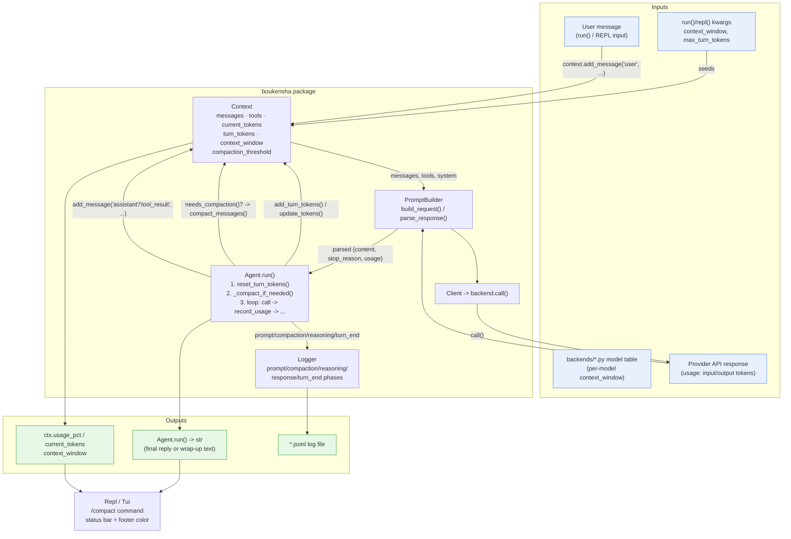
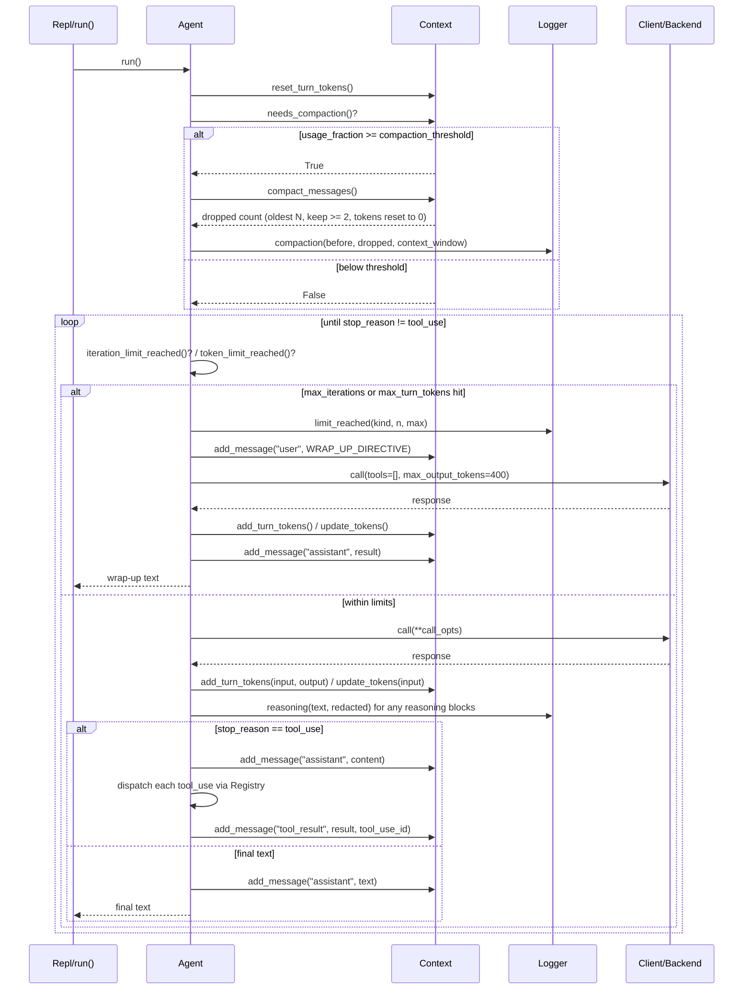

# Architecture — `boukensha` Context (Python)

Code review summary and architecture diagram for `src/boukensha/`.

This is the final snapshot in the tutorial series. It carries forward the full
stack built up through folders `00_config` … `11_tui` (config loading,
registry/tool dispatch, prompt building, multi-provider backends, the API
client, the tool-call agent loop, JSONL logging, the `run()` DSL, the REPL,
the standard tool library, and the Textual TUI) and adds **context-window
accounting and compaction**: `Context` now tracks token usage per turn and
cumulatively, the `Agent` proactively compacts message history before it
overflows the model's window, and both the REPL and TUI surface that state to
the user.

## Component overview

| Component | Responsibility |
|---|---|
| **`Config`** (`config.py`) | Resolves `.boukensha`, loads `.env`/`settings.yaml`, exposes task settings and MUD connection config. Unchanged from earlier folders. |
| **`Context`** (`context.py`) | Holds everything needed for one API call: `task`, `system`, `working_dir`, registered `tools`, `messages`, and — new in this folder — `context_window`, `compaction_threshold`, `current_tokens`, `turn_tokens`. Adds `update_tokens()`, `add_turn_tokens()`/`reset_turn_tokens()`, the `usage_fraction`/`usage_pct` properties, `needs_compaction()`, and `compact_messages()` (drops the oldest N messages, keeping at least 2, and resets `current_tokens` to 0). Still a plain stateful class, not a dataclass. |
| **`Message`** (`message.py`) | Immutable-ish dataclass: `role`, `content`, optional `tool_use_id`. Unchanged. |
| **`Tool`** (`tool.py`) | Dataclass describing a registered tool (`name`, `description`, `parameters`, `block`). Unchanged. |
| **`Registry`** (`registry.py`) | Holds `Context`, registers tools into `context.tools`, dispatches a tool call by name to its `block`. Unchanged. |
| **`RunDSL`** (`run_dsl.py`) | Minimal `self` surface (`tool()`) exposed inside a `tool_registrar` callback passed to `boukensha.run()`/`repl()`. Unchanged. |
| **`PromptBuilder`** (`prompt_builder.py`) | Builds the provider-specific request payload from `Context` (messages, tools, system prompt) and parses a provider response into `{"content", "stop_reason", "usage"}`. Unchanged. |
| **`backends/*`** (`base.py`, `anthropic.py`, `openai.py`, `gemini.py`, `ollama.py`, `ollama_cloud.py`) | One adapter per provider; each exposes a static model table including a `context_window` figure per model (e.g. Claude models at 200K/1M, Gemini at ~1.05M, local Ollama models at 40K–256K). `Context.context_window` is normally seeded from this table via the resolved model, though `run()`/`repl()` also accept an explicit override. |
| **`Client`** (`client.py`) | Thin HTTP wrapper around `PromptBuilder.backend`; `REQUEST_TIMEOUT_SECONDS` raised from 30 → 120 in this folder (longer agent turns with larger contexts need more headroom). |
| **`Agent`** (`agent.py`) | Drives the tool-call loop. New in this folder: calls `context.reset_turn_tokens()` and `_compact_if_needed()` at the start of every `run()`; after each model response, records usage into the context (`_record_usage`) and checks a new `max_turn_tokens` ceiling alongside the existing `max_iterations` ceiling, wrapping up gracefully via the same `WRAP_UP_DIRECTIVE` path used for iteration limits. Also now logs `reasoning` blocks. Accepts an optional `vitals: VitalsTracker` parameter; after dispatching each tool batch, calls `vt.hint` and — if a hint is present — injects it as a synthetic `tool_result` message so the model sees it before its next reply. |
| **`Logger`** (`logger.py`) | Structured JSONL writer. `prompt()` gained a `context_window` field; two new phases: `compaction` (before/dropped/context_window) and `reasoning` (text/redacted). |
| **`Repl`** (`repl.py`) | Interactive session loop. New slash commands `/compact` (manually drop oldest ~40% of messages) and `/mud`/`/file` (list registered tools by group, using a hardcoded `_MUD_TOOL_NAMES` set). Accepts and forwards `max_turn_tokens` to each turn's `Agent`. |
| **`Tui`** (`tui.py`) | Textual UI wrapping `Repl`. Replaces the old ad-hoc `_session_input_tokens` counter with `Context.current_tokens`/`usage_pct`/`context_window` directly; status bar and footer show `used/max (pct%)` and turn `⚠`/color-class (`ctx-warn` at ≥70%, `ctx-alert` at ≥85%) once usage crosses those thresholds; also renders a "context compacted — N messages dropped" line on the `compaction` log phase. Tracks the app thread explicitly (`threading.current_thread()`) so log callbacks from the agent can tell whether they're already on the Textual event-loop thread and skip the unnecessary `call_from_thread` hop. |
| **`tools/*`** (`file_system.py`, `shell.py`, `mud.py`) | Standard tool library (filesystem ops, sandboxed shell, MUD socket commands). `mud.py` gained a `confirm_affordance` call in its `_observe` hook: when a `drink` or `eat` command succeeds, the current room's capability tag is confirmed on the `RoomGraph`. |
| **`tools/map.py`** (`RoomGraph`) | Persistent directed room graph. New in this folder: affordance tagging (`can_drink`, `can_eat`, `can_rest`, `can_heal`) inferred from room descriptions on observe; `rooms_with_affordance(tag)` and `confirm_affordance(node_key, tag)` for capability queries and post-action confirmation; loop detection in `map_here` (warns when the same room appears too many times in recent history); `map_find_capability` tool (BFS to nearest capable room); `map_path_to` now tries exact name first, then falls back to capability keyword matching. |
| **`tools/vitals.py`** (`VitalsTracker`) | New in this folder. Passively scans every MUD response for thirst/hunger phrases and for HP values from `score` output. Exposes a `hint` property (`str | None`) that returns a one-line directive when HP is low or the character is thirsty or hungry. Stateless between sessions — tracks only the most recent response; no persistence needed since MUD state is always re-observed. |
| **`tasks/base.py` / `tasks/player.py`** | Task contract (`provider()`, `model()`, `system_prompt()`, `max_iterations()`, `max_output_tokens()`) and the concrete `Player` task. Unchanged. |
| **`__init__.py` (`boukensha.run()` / `boukensha.repl()`)** | Top-level entry points; both gained `context_window: int = 200_000` and `max_turn_tokens: int | None = None` parameters, threaded straight into `Context(...)` and `Agent(...)`/`Repl(...)` respectively. |

Design note: token accounting lives entirely on `Context` (the data owner);
`Agent` only orchestrates *when* to ask `Context` to update or compact itself,
mirroring the existing split where `Context` owns state and `Agent` owns
control flow.

## Data flow diagram

## Compaction sequence

Zooms in on the one non-trivial control-flow path added in this folder:
`Agent.run()` deciding whether to compact context before making an API call,
and whether to stop the loop on a token ceiling instead of an iteration
ceiling.

## Notes from review

- **Proactive, not reactive, compaction**: `_compact_if_needed()` runs once at the *start* of `run()`, before the first API call of a turn — it checks the token usage recorded from the *previous* turn's response, so compaction always happens with a one-turn lag rather than mid-turn. This is a deliberate simplification (there is no way to know a turn's token cost before making the call), but it means a single very large turn can still overflow the window before the next compaction check.
- **Two independent circuit breakers**: `max_iterations` (tool-call count) and `max_turn_tokens` (cumulative input+output tokens for the turn) are checked separately each loop iteration and both funnel into the same `_wrap_up()` path — same graceful-degradation shape as the pre-existing iteration limit, now generalized. `max_turn_tokens` defaults to `0` (disabled) via `int(max_turn_tokens or 0)`, so callers must opt in.
- **`compact_messages()` always keeps at least 2 messages**: `drop_count = min(drop_count, len(self.messages) - 2)` prevents compaction from ever wiping the conversation to zero or one message, even at extreme `target_fraction` values — a deliberate floor rather than a fail-fast error.
- **Token accounting resets to zero on compaction, not to a recomputed estimate**: `compact_messages()` sets `current_tokens = 0` unconditionally rather than estimating the token count of the surviving messages. This is optimistic — the next turn's real usage (from the provider's `usage` field) overwrites it via `update_tokens()`, so the zero is only ever visible for the sliver between compaction and the next response.
- **`update_tokens()` uses the *input* token count as `current_tokens`**: `_record_usage()` calls `add_turn_tokens(input, output)` (cumulative, for the turn-limit check) but `update_tokens(input)` (absolute, for window-usage display) — output tokens are deliberately excluded from `current_tokens` since they represent the *next* call's input growth, not the current context size in isolation. Worth flagging if a future compaction estimate ever needs "true" size including outstanding output.
- **Statelessness preserved where it already existed**: `Registry`, `PromptBuilder`, `tasks/*` remain unchanged — the new token/compaction logic is confined to `Context` (data) and `Agent` (orchestration), keeping the existing ownership boundaries intact rather than smearing context-window logic across the stack.
- **UI thresholds are hardcoded, not config-driven**: `CTX_WARN_PCT = 70` / `CTX_ALERT_PCT = 85` live directly in `tui.py`, separate from `Context.compaction_threshold` (0.85 default) — the TUI's "alert" color and the agent's actual compaction trigger happen to line up at 85% today but are two independent constants that could silently drift apart.
- **`/compact` in the REPL bypasses the threshold check entirely**: the slash command calls `context.compact_messages()` directly, ignoring `needs_compaction()` — a user can manually compact well below 85% usage, which is intentional (manual override) but means the same method serves both an automatic safety net and a user-triggered escape hatch with no distinction in the log (`Logger.compaction()` is only called from `Agent._compact_if_needed()`, so manual `/compact` calls are *not* logged).
- **`REQUEST_TIMEOUT_SECONDS` quietly quadrupled (30 → 120)**: a config-adjacent change bundled into this folder's diff, presumably because larger context windows produce longer-running calls; it's a module-level constant, not exposed as a parameter, so any regression here is a code change, not a config change.
