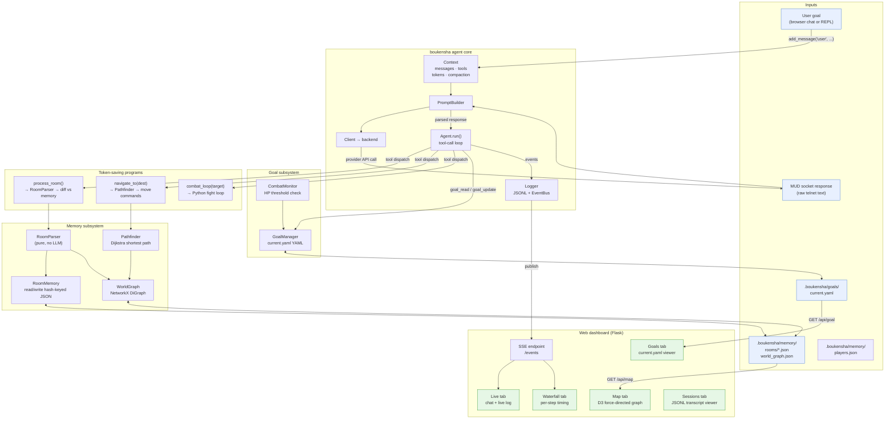
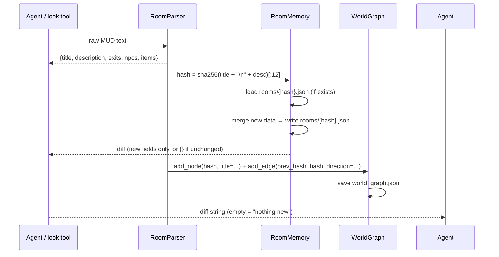

# Architecture — `agent-exp`

Enhanced MUD agent with persistent room memory, goal tracking, token-saving
programs, and a Python web dashboard.

## Component Overview

| Component | Location | Responsibility |
|---|---|---|
| **`RoomParser`** | `src/boukensha/memory/parser.py` | Pure function: raw MUD `look` text → structured dict (title, description, exits, npcs, items) |
| **`RoomMemory`** | `src/boukensha/memory/room_memory.py` | Reads/writes `.boukensha/memory/rooms/{hash}.json`; hash = `sha256(title + "\n" + desc)[:12]` |
| **`WorldGraph`** | `src/boukensha/memory/world_graph.py` | NetworkX DiGraph of rooms connected by exit edges; persisted to `.boukensha/memory/world_graph.json` |
| **`Pathfinder`** | `src/boukensha/memory/pathfinder.py` | Dijkstra shortest path over `WorldGraph`; returns ordered direction list |
| **`GoalManager`** | `src/boukensha/goals/goal_manager.py` | Reads/writes `.boukensha/goals/current.yaml`; exposes `read()`, `update(**kwargs)`, `reset()` |
| **`CombatMonitor`** | `src/boukensha/goals/combat_monitor.py` | Stateless: checks HP vs threshold; returns flee directive if needed |
| **`EventBus`** | `src/boukensha/dashboard/event_bus.py` | Thread-safe queue; `Logger` publishes structured events; SSE endpoint consumes |
| **`Dashboard`** | `src/boukensha/dashboard/app.py` | Flask app — Overview (default), Live, Map, Waterfall, Goals, Sessions tabs; SSE feed; static force-directed map |
| **`PlayerTracker`** | `src/boukensha/memory/player_tracker.py` | Reads/writes `.boukensha/memory/players.json`; tracks each character's room position (current + previous) and last-known stats |
| **`PlayerStats`** | `src/boukensha/memory/player_stats.py` | Pure function: parses the MUD `score` command's raw text into `{hp, max_hp, mana, max_mana, move, max_move}` |
| **`world_stats`** | `src/boukensha/memory/world_stats.py` | `frontier_stats()`/`entity_stats()` — aggregate known-vs-mapped exits and unique mobs/objects across every recorded room, for the Overview tab |
| **`navigate_to` tool** | `src/boukensha/tools/navigation.py` | Python-only pathfinding + move execution; no LLM per step |
| **`process_room` tool** | `src/boukensha/tools/room_processor.py` | Parses current room, diffs vs memory; returns only new/changed info to LLM |
| **`combat_loop` tool** | `src/boukensha/tools/combat.py` | Python fight loop; calls LLM only for skill decisions |
| **`bin/boukensha`** | `bin/boukensha` | CLI entry point: launches `repl()` with `--web` (default) or `--no-web` |
| **Existing core** | `src/boukensha/*.py` | Agent loop, backends, JSONL logger, context, REPL, TUI — unchanged |

---

## Data Flow Diagram



---

## Room Memory Flow

Every time the agent calls `process_room()` (or whenever `look` returns):



Only the diff is returned to the LLM — if the agent has been in this room before and nothing changed, it gets an empty string back, consuming almost no tokens.

---

## Goal File Schema

`.boukensha/goals/current.yaml`:

```yaml
current_goal: "Explore the Temple of Midgaard"
priority: explore          # explore | fight | heal | flee | idle
hp_flee_threshold: 5       # flee combat if HP drops to or below this
status: active             # active | paused | completed | flee
notes: "Found north exit to temple courtyard"
last_updated: "2026-07-27T14:32:00Z"
mud_basics: |
  - Use 'score' to check HP/mana/moves
  - Use 'look' to describe current room
  - Use 'exits' to list available exits
  - north/south/east/west/up/down to move
  - 'kill <target>' to attack
  - 'flee' to escape combat
```

`GoalManager` writes this file atomically (write to `.tmp`, rename) so the dashboard can poll it safely.

---

## Web Dashboard Tabs

| Tab | Data source | Update mechanism |
|---|---|---|
| **Live** | SSE event stream | Push — each Logger event streams immediately |
| **Map** | `GET /api/map` → world_graph.json | Pull on tab load + auto-refresh every 30s |
| **Waterfall** | SSE event stream (iteration/tool_call/tool_result phases) | Push — builds rows as events arrive |
| **Goals** | `GET /api/goal` → current.yaml | Pull on tab load + auto-refresh every 5s |
| **Sessions** | `GET /api/sessions` → .boukensha/sessions/*.jsonl | Pull — replaces Ruby log_viz |

The dashboard runs as a background thread inside the same Python process when `--web` is passed, or as a standalone process (`boukensha --dashboard-only`).

---

## Token Minimization Strategy

| Situation | Old behavior (LLM per step) | New behavior (program-first) |
|---|---|---|
| Entering a known room | LLM reads full `look` output | `process_room()` returns diff — often empty |
| Navigating to a destination | LLM decides each move step-by-step | `navigate_to(dest)` runs Dijkstra, issues moves in a Python loop |
| Fighting a weak mob | LLM decides each attack round | `combat_loop(target)` loops `attack` commands; LLM only invoked for skill choice |
| HP drops below threshold | LLM decides what to do | `CombatMonitor` updates goal to `flee` + returns directive; LLM reads directive |
| Unknown room | LLM reads full `look` output | `process_room()` returns full data (LLM still needed for first visit) |

---

## File Layout (new files only)

```
agent-exp/
├── bin/
│   └── boukensha                      # CLI entry point
├── src/boukensha/
│   ├── memory/
│   │   ├── __init__.py
│   │   ├── parser.py                  # RoomParser
│   │   ├── room_memory.py             # RoomMemory
│   │   ├── world_graph.py             # WorldGraph
│   │   └── pathfinder.py             # Pathfinder
│   ├── goals/
│   │   ├── __init__.py
│   │   ├── goal_manager.py            # GoalManager
│   │   └── combat_monitor.py          # CombatMonitor
│   ├── tools/
│   │   ├── navigation.py              # navigate_to tool
│   │   ├── room_processor.py          # process_room tool
│   │   └── combat.py                  # combat_loop tool
│   └── dashboard/
│       ├── __init__.py
│       ├── app.py                     # Flask app
│       ├── event_bus.py               # Thread-safe event queue
│       ├── static/
│       │   ├── app.js                 # Tab routing + SSE client
│       │   ├── map.js                 # D3 force-directed graph
│       │   ├── waterfall.js           # Waterfall chart
│       │   └── style.css
│       └── templates/
│           └── index.html             # Single-page shell
└── tests/
    ├── test_room_parser.py
    ├── test_room_memory.py
    ├── test_world_graph.py
    ├── test_pathfinder.py
    ├── test_goal_manager.py
    └── test_dashboard_api.py
```

---

## Notes

- **RoomParser is pure** — no side effects, fully unit-testable without a live MUD connection.
- **WorldGraph uses networkx** — already a transitive dependency via graphify; if not, add it to `pyproject.toml`.
- **Dashboard is modular** — each tab is a separate JS module. Adding a new tab means: (1) add a `<button>` in `index.html`, (2) add a JS module, (3) optionally add a `/api/...` endpoint in `app.py`. No changes to core agent code.
- **`--no-web` still works** — `repl(tui=True)` launches the Textual TUI exactly as before; `repl(tui=False)` gives the plain REPL. The web path is additive.
- **Log_viz Ruby app** — superseded by the Sessions tab in the Python dashboard. The `log_viz/` folder can be kept for reference or deleted.
