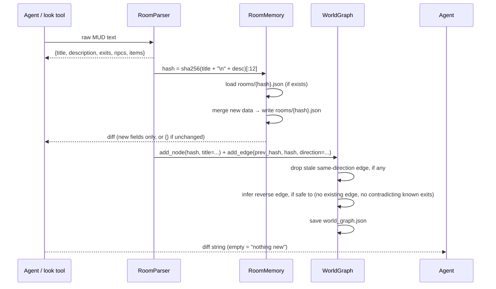

# Architecture — `agent-exp`

Enhanced MUD agent with persistent room memory, goal tracking, token-saving
programs, autonomous exploration, combat safety gates, and a Python web
dashboard.

## Component Overview

| Component | Location | Responsibility |
|---|---|---|
| **`RoomParser`** | `src/boukensha/memory/parser.py` | Pure function: raw MUD `look` text → structured dict (title, description, exits, npcs, items). Skips leading zone-banner/failure-message lines (anything ending in `.`/`!`/`?`) to find the real title, so e.g. "This zone is above the level of most zones..." or "Alas, you cannot go that way..." never gets recorded as a fake room. Files corpses ("... is lying here.") as items, not npcs, regardless of name length. |
| **`RoomMemory`** | `src/boukensha/memory/room_memory.py` | Reads/writes `.boukensha/memory/rooms/{hash}.json`; hash = `sha256(title + "\n" + desc)[:12]` |
| **`WorldGraph`** | `src/boukensha/memory/world_graph.py` | NetworkX DiGraph of rooms connected by exit edges; persisted to `.boukensha/memory/world_graph.json`. `add_edge()` drops any stale same-direction edge to a different room before recording the new one, and — only when no real edge already claims that direction on the far side, and only when it doesn't contradict the destination's own known exits — infers the reverse edge too, so a room only ever approached from one side is still pathfinding-reachable. |
| **`Pathfinder`** | `src/boukensha/memory/pathfinder.py` | Dijkstra shortest path over `WorldGraph`. Returns a `Route` (directions + the expected room hash after each step, for drift detection). `route_by_title()` matches by substring first, then falls back to all-significant-words-must-match overlap (`word_overlap_matches`) to avoid a generic shared word — e.g. "guild" — matching the wrong room; when multiple rooms match, picks whichever has the shortest real route. |
| **`RoomAliases`** | `src/boukensha/memory/room_aliases.py` | Reads/writes `.boukensha/memory/room_aliases.json`; case-insensitive `alias -> room_hash` map. `navigate_to` checks this before title/landmark matching, so a term the agent has explicitly confirmed once (via `navigate_alias_add`) resolves deterministically thereafter, bypassing any ambiguous word-overlap match. |
| **`GoalManager`** | `src/boukensha/goals/goal_manager.py` | Reads/writes `.boukensha/goals/current.yaml`; exposes `read()`, `update(**kwargs)`, `reset()` |
| **`KnowledgeManager`** | `src/boukensha/memory/knowledge.py` | Reads/writes `.boukensha/knowledge.yaml`; exposes `add(topic, fact, source)`, `search(query)`, `read_all()`; atomic writes; case-insensitive deduplication by topic |
| **`BlockedExits`** | `src/boukensha/memory/blocked_exits.py` | Persists exits confirmed to need something the agent doesn't have yet (locked door, dark room needing light) per room+direction, with a reason string, to `.boukensha/memory/blocked_exits.json` — so `explore()` stops retrying them every pass. `unmark()` clears one once a workaround is found. |
| **`darkness`** | `src/boukensha/memory/darkness.py` | `is_dark_room(raw)` — detects the MUD's "pitch black" response (no title/description/exits), whether standing in it or peeking into it from next door |
| **`CombatMonitor`** | `src/boukensha/goals/combat_monitor.py` | Stateless: checks HP vs threshold; returns flee directive if needed |
| **`EventBus`** | `src/boukensha/dashboard/event_bus.py` | Thread-safe queue; `Logger` publishes structured events; SSE endpoint consumes |
| **`Dashboard`** | `src/boukensha/dashboard/app.py` | Flask app — Overview (default), Live, Map, Waterfall, Goals, Sessions tabs; SSE feed; static compass-grid map with player position markers |
| **`PlayerTracker`** | `src/boukensha/memory/player_tracker.py` | Reads/writes `.boukensha/memory/players.json`; tracks each character's room position (current + previous) and last-known stats |
| **`PlayerStats`** | `src/boukensha/memory/player_stats.py` | Pure function: parses the MUD `score` command's raw text into `{hp, max_hp, mana, max_mana, move, max_move}` |
| **`world_stats`** | `src/boukensha/memory/world_stats.py` | `frontier_stats()`/`entity_stats()` — aggregate known-vs-mapped exits and unique mobs/objects across every recorded room, for the Overview tab |
| **`_walk` (`walk_route`)** | `src/boukensha/tools/_walk.py` | Shared step-by-step route walker used by both `navigate_to` and `explore`. Executes a `Route` one move at a time and stops the instant reality stops matching the plan — never blindly finishes a multi-step route against a room the character isn't actually in anymore. Returns a `WalkOutcome` (`arrived` / `blocked` / `drifted` / `lost`), self-healing the graph with the edge actually observed on `drifted`. |
| **`navigate_to` tool** | `src/boukensha/tools/navigation.py` | Python-only pathfinding + move execution; no LLM per step. Checks a learned alias first (`RoomAliases`), then matches room titles, then falls back to searching every mapped room's description/items/npcs (a landmark like "the fountain"); disambiguates multiple matches by shortest route. When nothing matches at all, its error message lists every currently known room title so the agent can retry with the exact one and then call `navigate_alias_add` to remember it — rather than a flat "no known path" dead end. Distinguishes "known room but unreachable" (one-way passage) from "no match" (with near-miss suggestions or the full title list) so the LLM gets an actionable message. |
| **`navigate_alias_add` tool** | `src/boukensha/tools/navigation.py` | Resolves a `destination` the same way `navigate_to` does (title, then landmark search, tie-broken by distance from the current room) and persists `alias -> room_hash` via `RoomAliases`. Called by the agent once it has confirmed which room a fuzzy shorthand ("bakery," "your guild") actually refers to, so future `navigate_to` calls with that shorthand resolve directly. |
| **`explore` tool** | `src/boukensha/tools/exploration.py` | Finds the nearest room with a known-but-unwalked exit (seen in a `look`'s `[ Exits: ]` line but with no graph edge yet), routes there via `Pathfinder`/`walk_route`, then probes the frontier exit itself — peeks before moving to avoid walking blind into a dark room, retries a closed (not locked) door once, and marks the exit blocked via `BlockedExits` if it still doesn't yield. No destination needed; call repeatedly to expand the map outward. |
| **`process_room` tool** | `src/boukensha/tools/room_processor.py` | Parses current room, diffs vs memory; returns only new/changed info to LLM |
| **`combat_loop` tool** | `src/boukensha/tools/combat.py` | Python fight loop; calls LLM only for skill decisions. Hard-refuses to engage a target that isn't a currently-known living NPC in the room (catches "fighting" a corpse or a name that's simply not there), and separately refuses (regardless of the first check) if its own `consider` call comes back matching a danger-phrase list (e.g. "Do you feel lucky, punk?") — both gates skippable only via explicit `force=true`. On a kill, auto-loots the corpse (`auto_loot=true` by default) and folds the loot result into the response. |
| **`attack` / `consider` / `skill_strike`** | `src/boukensha/tools/mud.py` | Gated the same way as `combat_loop`: refuse a target that isn't in the shared "known NPCs in this room" list, populated by every `move`/bare `look`. `skill_strike`'s `rescue`/`assist` are exempt (they target a player, not an npc). |
| **`door` tool** | `src/boukensha/tools/mud.py` | Open/close/lock/unlock a door or container. A direction target (e.g. `north`) sends `<action> door <direction>`, matching what the MUD's door syntax actually expects; a named target sends `<action> <target>` directly. |
| **`knowledge_add` / `knowledge_search` tools** | `src/boukensha/tools/knowledge.py` | Agent calls `knowledge_add` to persist a discovered fact; `knowledge_search` for keyword lookup across all stored facts |
| **`build_knowledge_section`** | `src/boukensha/_knowledge_injection.py` | Formats stored entries into a `## World Knowledge` block (≤2000-token cap) appended to the system prompt at startup |
| **`bin/boukensha`** | `bin/boukensha` | CLI entry point: launches `repl()` with `--web` (default) or `--no-web` |
| **Existing core** | `src/boukensha/*.py` | Agent loop, backends, JSONL logger, context, REPL, TUI — unchanged |

---

## Cross-Tool Position Sync

`move` (raw), `navigate_to`, `explore`, and `process_room` are four separate
tool registrars that can each move the character, but only one of them —
whichever ran most recently — knows where the character actually is. They
share three single-slot references, created once in `__init__.py` and
passed to every registrar:

- **`prev_hash_ref`** — the room hash the *next* raw `move` should draw its
  edge from.
- **`last_direction_ref`** — the direction of a move still in flight, so a
  crash/disconnect mid-move doesn't leave a bogus edge behind.
- **`current_npcs_ref`** — the NPC list `RoomParser` saw in the last room
  look, read by every combat tool's presence gate (see below).

Without this, a live bug reproduced in `test_position_sync.py`: `navigate_to`
or `explore` would move the character, but a *later* raw `move` call would
still wire its edge from the stale room `prev_hash_ref` remembered from
before those tools ran — producing impossible double connections, like a
room ending up with two different "south" exits pointing at two different
rooms.

---

## Data Flow Diagram

```mermaid
flowchart TB
    subgraph inputs["Inputs"]
        USER["User goal\n(browser chat or REPL)"]
        MUD["MUD socket response\n(raw telnet text)"]
        MEMFILES[".boukensha/memory/\nrooms/*.json\nworld_graph.json\nblocked_exits.json\nroom_aliases.json"]
        PLAYERFILE[".boukensha/memory/\nplayers.json"]
        GOALFILE[".boukensha/goals/\ncurrent.yaml"]
        KNOWFILE[".boukensha/\nknowledge.yaml"]
    end

    subgraph core["boukensha agent core"]
        CTX["Context\nmessages · tools\ntokens · compaction"]
        AGENT["Agent.run()\ntool-call loop"]
        BUILDER["PromptBuilder"]
        CLIENT["Client → backend"]
        LOGGER["Logger\nJSONL + EventBus"]
    end

    subgraph memory["Memory subsystem"]
        PARSER["RoomParser\n(pure, no LLM)"]
        ROOMEMEM["RoomMemory\nread/write hash-keyed JSON"]
        WGRAPH["WorldGraph\nNetworkX DiGraph\n+ reverse-edge inference"]
        PATHFIND["Pathfinder\nDijkstra + Route\ntitle/landmark matching"]
        BLOCKED["BlockedExits\nlocked/dark exits, with reason"]
        DARK["darkness.is_dark_room()"]
        PLAYERTRACK["PlayerTracker\nposition + stats"]
        WSTATS["world_stats\nfrontier_stats / entity_stats"]
    end

    subgraph goals["Goal subsystem"]
        GOALMGR["GoalManager\ncurrent.yaml YAML"]
        COMBAT["CombatMonitor\nHP threshold check"]
    end

    subgraph knowledge["Knowledge subsystem"]
        KNOWMGR["KnowledgeManager\nknowledge.yaml YAML"]
        KNOWINJECT["build_knowledge_section()\n≤2000-token prompt injection"]
        KNOWTOOLS["knowledge_add / knowledge_search\nagent tools"]
    end

    subgraph tools["Token-saving programs\n(registered as agent tools)"]
        NAVTOOL["navigate_to(dest)\n→ Pathfinder → walk_route"]
        EXPLORETOOL["explore()\n→ nearest frontier → walk_route\n→ probe exit, avoid darkness"]
        ROOMTOOL["process_room()\n→ RoomParser → diff vs memory"]
        CMBTOOL["combat_loop(target)\n→ npc-presence + danger gates\n→ Python fight loop → auto-loot"]
        WALKSHARED["walk_route()\nshared by navigate_to + explore"]
    end

    subgraph dashboard["Web dashboard (Flask)"]
        SSE["SSE endpoint\n/events"]
        OVERVIEWTAB["Overview tab (default)\nrooms/frontier/entities summary\n+ per-player stats & location"]
        LIVETAB["Live tab\nchat + live log"]
        MAPTAB["Map tab\ncompass-grid layout\n+ player position markers"]
        WFTAB["Waterfall tab\nper-step timing"]
        GOALTAB["Goals tab\ncurrent.yaml viewer"]
        SESTAB["Sessions tab\nJSONL transcript viewer"]
    end

    USER -->|"add_message('user', ...)"| CTX
    CTX --> BUILDER
    BUILDER --> CLIENT
    CLIENT -->|"provider API call"| MUD
    MUD --> BUILDER
    BUILDER -->|"parsed response"| AGENT

    AGENT -->|"tool dispatch"| ROOMTOOL
    AGENT -->|"tool dispatch"| NAVTOOL
    AGENT -->|"tool dispatch"| EXPLORETOOL
    AGENT -->|"tool dispatch"| CMBTOOL
    AGENT -->|"goal_read / goal_update"| GOALMGR
    AGENT -->|"knowledge_add / knowledge_search"| KNOWTOOLS
    AGENT -->|"events"| LOGGER

    ROOMTOOL --> PARSER
    PARSER --> ROOMEMEM
    ROOMEMEM <--> MEMFILES
    PARSER --> WGRAPH
    WGRAPH <--> MEMFILES
    NAVTOOL --> PATHFIND
    EXPLORETOOL --> PATHFIND
    EXPLORETOOL --> BLOCKED
    EXPLORETOOL --> DARK
    BLOCKED <--> MEMFILES
    PATHFIND --> WGRAPH
    NAVTOOL --> WALKSHARED
    EXPLORETOOL --> WALKSHARED
    WALKSHARED --> WGRAPH
    COMBAT --> GOALMGR
    GOALMGR <--> GOALFILE
    KNOWTOOLS --> KNOWMGR
    KNOWMGR <--> KNOWFILE
    KNOWINJECT --> KNOWMGR
    KNOWINJECT -->|"appended to system prompt at startup"| CTX
    AGENT -->|"check(kind=score)"| PLAYERTRACK
    PLAYERTRACK <--> PLAYERFILE
    WSTATS --> WGRAPH
    WSTATS --> ROOMEMEM

    LOGGER -->|"publish"| SSE
    SSE --> LIVETAB
    SSE --> WFTAB
    MEMFILES -->|"GET /api/map"| MAPTAB
    PLAYERFILE -->|"GET /api/players"| MAPTAB
    GOALFILE -->|"GET /api/goal"| GOALTAB
    MEMFILES -->|"GET /api/overview"| OVERVIEWTAB
    PLAYERFILE -->|"GET /api/overview"| OVERVIEWTAB

    classDef input fill:#e8f0fe,stroke:#4a7ad4;
    classDef output fill:#e6f7e6,stroke:#3a9a3a;
    class USER,MUD,MEMFILES,PLAYERFILE,GOALFILE,KNOWFILE input;
    class OVERVIEWTAB,LIVETAB,MAPTAB,WFTAB,GOALTAB,SESTAB output;
```



---

## Room Memory Flow

Every time the agent calls `process_room()` (or whenever `look` returns):



Only the diff is returned to the LLM — if the agent has been in this room before and nothing changed, it gets an empty string back, consuming almost no tokens.

---

## Exploration & Route-Walking Reliability

`navigate_to` and `explore` both plan a `Route` (a list of directions plus
the room hash expected after each one) and then hand it to the shared
`walk_route()` in `_walk.py`, which executes it one step at a time and
checks reality against the plan after every single move:

| Outcome | Meaning | What happens |
|---|---|---|
| `arrived` | Every step landed in the expected room | Route complete, edges (re-)confirmed along the way |
| `blocked` | A move didn't change rooms at all | Stop immediately; message tells the caller to check what's blocking it |
| `drifted` | The room changed, but not to the room the graph predicted | Stop; the edge actually observed is recorded (self-healing the graph), so the caller can replan from where it really is |
| `lost` | Couldn't determine the current room after moving | Stop; nothing is assumed about position |

This means a stale or wrong graph edge is corrected the moment it's
actually walked, rather than silently compounding into a route that finishes
somewhere else entirely.

`explore()` layers frontier-finding on top of this: it scans every mapped
room for a known exit (from a past `look`'s `[ Exits: ]` line) with no
corresponding graph edge yet, routes to the nearest one, then probes it —
peeking with `look <direction>` before ever moving, to avoid walking blind
into a dark room (`darkness.is_dark_room()`). If the peek doesn't catch it
(e.g. behind a closed door), it retreats the way it came rather than leaving
the character somewhere it can't see. A door that doesn't budge gets one
`open door <direction>` retry; if the exit still doesn't yield, it's marked
blocked (`BlockedExits`, with a reason) so `explore()` skips it on future
calls instead of retrying forever.

**`WorldGraph` reverse-edge inference:** edges are only ever recorded in the
direction actually walked, but CircleMUD exits are almost always
bidirectional. `add_edge()` fills in the reverse edge automatically —
*unless* the destination room already has a real edge claimed in that
direction (a genuine one-way passage elsewhere), or the destination's own
recorded exits are already known and don't include the reverse direction (so
a confirmed one-way passage is never overwritten with a fabricated way
back). This is what makes a room reachable in pathfinding the moment it's
first visited from any side, instead of only after being approached from
every direction at least once.

---

## Combat Safety Gates

`combat_loop` (and the lower-level `attack`/`consider`/`skill_strike` in
`mud.py`) refuse before ever sending a command to the MUD, in two
independent, code-level (not LLM-judgment) layers — both bypassable only
with an explicit override:

1. **Target-presence gate** — the target must fuzzy-match an entry in
   `current_npcs_ref`, the NPC list `RoomParser` saw in the last `move`/bare
   `look`. A room with only a corpse (`RoomParser` files those as items, not
   npcs, regardless of name length) or an unrelated/absent name refuses
   immediately with a message listing what's actually in the room, instead
   of sending a doomed command and relaying back the MUD's cryptic
   "Consider killing who?"/"That player is not here."
2. **Danger gate** (`combat_loop` only) — always runs `consider` itself
   first (regardless of whether the caller already did), and refuses if the
   response matches a known "you will lose badly" phrase (e.g. "Do you feel
   lucky, punk?", "miracle to win"). Marks the goal `status: flee` when it
   fires.

Pass `force=true` to `combat_loop` to skip both gates for a deliberate fight.

On a kill, `combat_loop` auto-loots the corpse (`get all corpse`) and folds
the result into its response; pass `auto_loot=false` to inspect the corpse
manually first instead.

---

## Goal File Schema

`.boukensha/goals/current.yaml`:

```yaml
current_goal: "Explore the Temple of Midgaard"
priority: explore          # explore | fight | heal | flee | idle
hp_flee_threshold: 5       # flee combat if HP drops to or below this
status: active             # active | paused | completed | flee
notes: "Found north exit to temple courtyard"
last_updated: "2026-07-27T14:32:00Z"
mud_basics: |
  - Use 'score' to check HP/mana/moves
  - Use 'look' to describe current room
  - Use 'exits' to list available exits
  - north/south/east/west/up/down to move
  - 'kill <target>' to attack
  - 'flee' to escape combat
```

`GoalManager` writes this file atomically (write to `.tmp`, rename) so the dashboard can poll it safely.

---

## Knowledge File Schema

`.boukensha/knowledge.yaml`:

```yaml
- topic: red key
  fact: Ask the guard near the east gate — he will give it to you if you ask.
  source: east gate guard
  timestamp: 2026-07-29T00:00:00Z

- topic: minotaur
  fact: Requires the red key to enter its chamber.
  source: innkeeper
  timestamp: 2026-07-29T00:01:00Z
```

**Fields:**

| Field | Purpose |
|---|---|
| `topic` | Short keyword label used for deduplication and search (case-insensitive) |
| `fact` | The useful information in plain English |
| `source` | Who or what revealed it — NPC name, room name, sign, etc. |
| `timestamp` | ISO 8601 UTC; set on every write |

**Deduplication:** When `knowledge_add` is called with a topic that matches an existing entry (case-insensitive), the old entry is replaced entirely. Conflicting or refined facts overwrite rather than accumulate.

**System prompt injection:** At startup, `KnowledgeManager.read_all()` (newest first) is passed to `build_knowledge_section()`, which formats entries up to a ~2000-token cap as a `## World Knowledge` block appended to the system prompt. Entries beyond the cap remain searchable via `knowledge_search`.

**Scope:** World-scoped — shared across all characters and playthroughs. The file is excluded from git (`.gitignore`) since it is runtime state.

---

## Blocked-Exits File Schema

`.boukensha/memory/blocked_exits.json`:

```json
{
  "a1b2c3d4e5f6": {
    "north": "dark (needs a light source)",
    "east": "blocked"
  }
}
```

Keyed by room hash, then direction, to a free-text reason. `explore()`
consults this before treating an exit as a frontier candidate; `unmark()`
clears an entry once the agent finds a way through (a key, a light source),
so it re-enters the frontier on the next `explore()` call. Older files
written as a plain list of directions (no reason) are still read correctly,
defaulting each to reason `"blocked"`.

---

## Web Dashboard Tabs

| Tab | Data source | Update mechanism |
|---|---|---|
| **Overview** (default) | `GET /api/overview` → world_graph.json + rooms/*.json (via `world_stats`) + players.json | Pull — loads eagerly on page load, since it's the tab shown first |
| **Live** | SSE event stream | Push — each Logger event streams immediately |
| **Map** | `GET /api/map` + `GET /api/players` → world_graph.json + players.json | Pull on tab load + auto-refresh every 3s |
| **Waterfall** | SSE event stream (iteration/tool_call/tool_result phases) | Push — builds rows as events arrive |
| **Goals** | `GET /api/goal` → current.yaml | Pull on tab load + auto-refresh every 5s |
| **Sessions** | `GET /api/sessions` → .boukensha/sessions/*.jsonl | Pull — replaces Ruby log_viz |

**Map tab layout:** rooms are placed on a fixed compass grid (north = up,
east = right, etc.) rather than a force-directed simulation, so "north of"
always actually renders above — up/down exits (no spare axis on a flat map)
render as short dashed diagonals instead. Rooms that would otherwise land on
the same cell (real MUD geometry is often non-Euclidean) are nudged to the
nearest free cell. Player positions render as colored star markers, one per
character in `players.json`, refreshed alongside the map. Clicking a room
opens a popup (with an arrow pointing at the room) showing its full
description/exits/npcs/items; clicking outside it, or panning/zooming,
dismisses it.

The dashboard runs as a background thread inside the same Python process when `--web` is passed, or as a standalone process (`boukensha --dashboard-only`).

---

## Token Minimization Strategy

| Situation | Old behavior (LLM per step) | New behavior (program-first) |
|---|---|---|
| Entering a known room | LLM reads full `look` output | `process_room()` returns diff — often empty |
| Navigating to a destination | LLM decides each move step-by-step | `navigate_to(dest)` runs Dijkstra, issues moves via `walk_route`, self-corrects on drift |
| Deciding where to explore next | LLM picks a direction to try | `explore()` finds the nearest unwalked exit itself, avoids known-blocked/dark ones, and reports what it found |
| Fighting a weak mob | LLM decides each attack round | `combat_loop(target)` loops `attack` commands, auto-loots on a kill; LLM only invoked for skill choice |
| HP drops below threshold | LLM decides what to do | `CombatMonitor` updates goal to `flee` + returns directive; LLM reads directive |
| Deciding whether a fight is safe | LLM judges the `consider` result | `combat_loop` gates on it itself and refuses if it looks like a loss, unless `force=true` |
| Unknown room | LLM reads full `look` output | `process_room()` returns full data (LLM still needed for first visit) |

---

## File Layout (new files only)

```
agent-exp/
├── bin/
│   └── boukensha                      # CLI entry point
├── src/boukensha/
│   ├── memory/
│   │   ├── __init__.py
│   │   ├── parser.py                  # RoomParser
│   │   ├── room_memory.py             # RoomMemory
│   │   ├── world_graph.py             # WorldGraph (+ reverse-edge inference)
│   │   ├── pathfinder.py              # Pathfinder, Route, title/landmark matching
│   │   ├── blocked_exits.py           # BlockedExits
│   │   ├── darkness.py                # is_dark_room()
│   │   ├── player_tracker.py          # PlayerTracker (position + stats)
│   │   ├── player_stats.py            # PlayerStats.parse_score()
│   │   ├── world_stats.py             # frontier_stats() / entity_stats()
│   │   └── knowledge.py               # KnowledgeManager
│   ├── goals/
│   │   ├── __init__.py
│   │   ├── goal_manager.py            # GoalManager
│   │   └── combat_monitor.py          # CombatMonitor
│   ├── tools/
│   │   ├── mud.py                     # low-level MUD tools + npc-presence gate
│   │   ├── navigation.py              # navigate_to tool
│   │   ├── exploration.py             # explore tool
│   │   ├── _walk.py                   # walk_route() shared by navigate_to/explore
│   │   ├── room_processor.py          # process_room tool
│   │   ├── combat.py                  # combat_loop tool (danger gate + auto-loot)
│   │   └── knowledge.py               # knowledge_add / knowledge_search tools
│   ├── _knowledge_injection.py        # build_knowledge_section() — prompt injection helper
│   └── dashboard/
│       ├── __init__.py
│       ├── app.py                     # Flask app
│       ├── event_bus.py               # Thread-safe event queue
│       ├── static/
│       │   ├── app.js                 # Tab routing + SSE client
│       │   ├── map.js                 # Compass-grid map + player markers
│       │   ├── waterfall.js           # Waterfall chart
│       │   └── style.css
│       └── templates/
│           └── index.html             # Single-page shell
└── tests/
    ├── test_room_parser.py
    ├── test_room_memory.py
    ├── test_world_graph.py
    ├── test_pathfinder.py
    ├── test_navigation_tool.py
    ├── test_exploration_tool.py
    ├── test_blocked_exits.py
    ├── test_darkness.py
    ├── test_position_sync.py
    ├── test_goal_manager.py
    ├── test_combat.py
    ├── test_combat_monitor.py
    ├── test_tools_mud.py
    ├── test_player_tracker.py
    ├── test_player_stats.py
    ├── test_world_stats.py
    ├── test_dashboard_api.py
    ├── test_knowledge_manager.py
    ├── test_tools_knowledge.py
    └── test_knowledge_injection.py
```

---

## Notes

- **RoomParser is pure** — no side effects, fully unit-testable without a live MUD connection.
- **WorldGraph uses networkx** — already a transitive dependency via graphify; if not, add it to `pyproject.toml`.
- **Dashboard is modular** — each tab is a separate JS module. Adding a new tab means: (1) add a `<button>` in `index.html`, (2) add a JS module, (3) optionally add a `/api/...` endpoint in `app.py`. No changes to core agent code.
- **`--no-web` still works** — `repl(tui=True)` launches the Textual TUI exactly as before; `repl(tui=False)` gives the plain REPL. The web path is additive.
- **Log_viz Ruby app** — superseded by the Sessions tab in the Python dashboard. The `log_viz/` folder can be kept for reference or deleted.
- **Reverse-edge inference is guarded, not naive** — `WorldGraph.add_edge()` only fabricates a return path when nothing contradicts it (see "Exploration & Route-Walking Reliability" above). A confirmed one-way passage is never silently overwritten.
- **Combat and navigation gates are code, not prompt instructions** — both were added after an LLM demonstrably saw a clear warning (a dangerous `consider` result, an absent target) and proceeded anyway. A hard refusal in the tool itself can't be argued past the way a system-prompt instruction can; `force=true` exists for the rare deliberate override.
